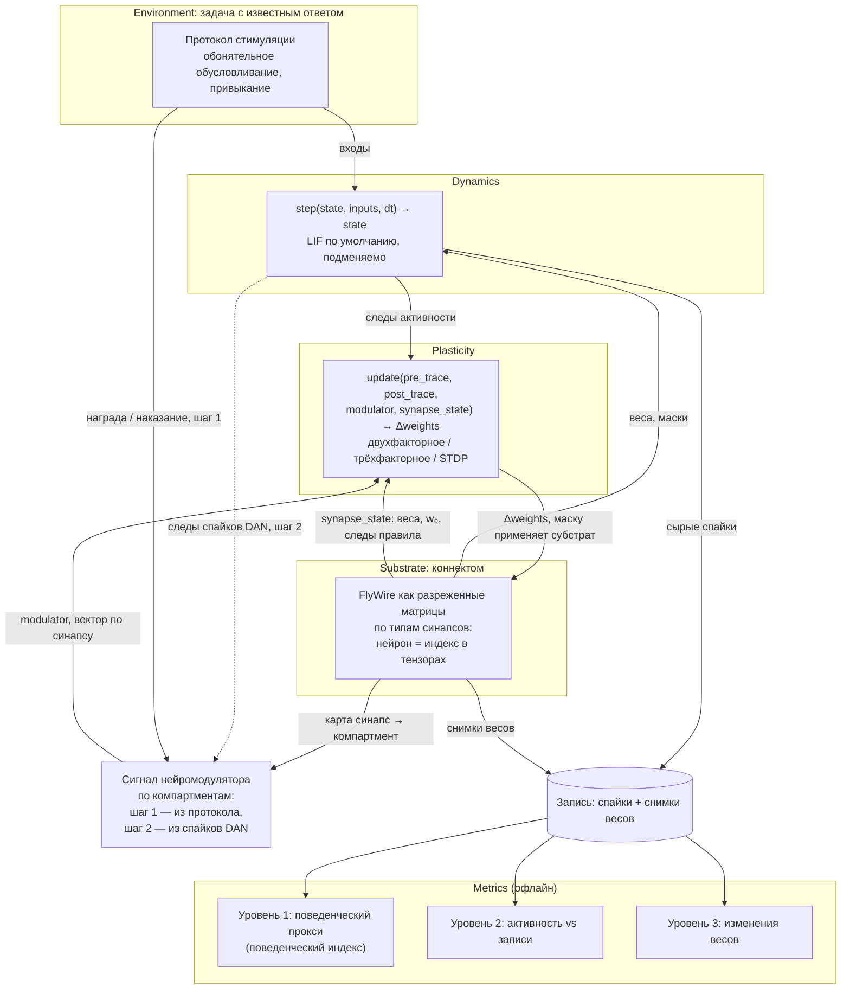
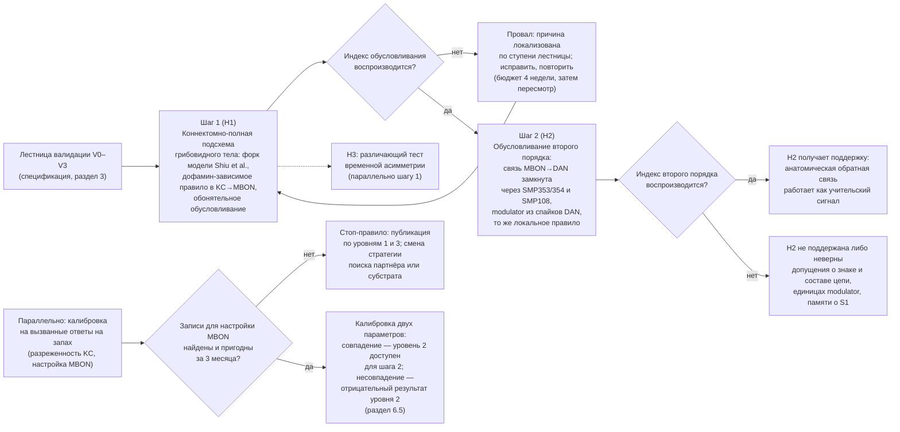

# Коннектомная подсхема грибовидного тела как субстрат обучения: отрицательный результат

**Подзаголовок:** Три предрегистрированные ступени валидации на модели Shiu et al.: разреженность клеток Кеньона достижима, жизнеспособный выход MBON — нет

**Версия 0.14, отчёт. Сентябрь 2026. История изменений — приложение Б.**

**Автор:** Дмитрий Кудрин (Dmitry Kudrin), 16th Research Lab MMC

**Контакт:** dmitry@16th.ai

**Аудитория:** те, кто собирается использовать полномозговую модель [2] на коннектоме FlyWire как субстрат для обучения в грибовидном теле; авторы и сопровождающие этой модели; исследователи, которым нужна работающая процедура предрегистрации вычислительного эксперимента.

**Как читать этот документ.** До версии 0.11 он был запросом на выполнение шага 1 — эксперимента по обонятельному обусловливанию на коннектомно-полной подсхеме. Версия 0.11 сделала его отчётом: сработало правило остановки, записанное в нём заранее (разделы 6.5 и 6.5б), и лестница на этом семействе моделей закрыта. Отсюда четыре слоя текста, и путать их не нужно:

- **Результат** — аннотация, разделы 5.7–5.11 и заключение (раздел 10). Это то, что измерено.
- **Метод, который переносится** — цели проектирования (раздел 4), устройство стенда (5.1–5.6), правило заморозки критериев (6.3) и публикации (6.4), плюс спецификация эксперимента отдельным документом. Это то, ради чего документ стоит читать, если вы делаете похожую работу.
- **Записи, сделанные до прогонов и не редактируемые после них** — разделы 5.8, 5.9, 6.5 и 6.5а; поправки к ним внесены датированными дополнениями (6.5а, 6.5б), а не правкой. Висячая ссылка на снятую таблицу 4 в разделе 6.5 оставлена намеренно, с объяснением на месте.
- **План, по которому шли и который не будет выполнен** — приложение Г. Шаг 1, шаг 2, контроль на коннектоме самца, риски плана и форма проекта перенесены туда дословно при ревизии v0.14: они остаются записью о том, что предусматривалось, и обещанием больше не являются.

---

## Аннотация

Алгоритм, по которому мозг меняет силу синапсов при обучении, неизвестен, и проверять кандидатные правила негде: полномозговые модели на коннектоме дрозофилы имеют замороженные веса [2], а модели обучения в грибовидном теле работают на редуцированных схемах с одним узлом на класс нейронов [3]. Мы собрали стенд, соединяющий одно с другим, и прежде чем ставить на нём эксперимент по обонятельному обусловливанию, провели лестницу валидации с критериями провала, замороженными хэшем до запуска. Лестница не пройдена, и этот документ — отчёт о том, где именно.

**Субстрат воспроизводится, выход не оживает.** Извлечённая подсхема тождественна полной модели, а не похожа на неё: на 33 условиях совпали 1 848 660 спайковых поездов из 1 848 660. После трёх подмен, которых требует шаг 1, она выходит на разреженный режим клеток Кеньона, но выходные нейроны молчат. Три предрегистрированные калибровочные ступени, на 447 и 285 точках сетки, не нашли ни одной точки, где шесть эталонных типов MBON лежат в рабочем диапазоне частот из открытых записей [38] при разреженности в полосе.

**Масштабом весов это не устраняется.** Третья ступень вводила общий множитель на веса KC→MBON. Четыре типа из шести он в коридор выводит; два — выходы компартментов α′2 и α′3m — молчат во всех 270 допустимых точках при любом его значении. Оба получают 100 % входа от клеток Кеньона подтипа α′β′, а те в этом семействе почти не отвечают: скаляр умножает вход, которого почти нет.

**Дефект назван, а не только локализован.** В живой мухе α′β′ — самый отзывчивый подтип, а не самый молчаливый: спайк у них возникает легче всего при сходном суммировании входов, и порог у них самый низкий [47]; независимая работа на другой задаче даёт то же направление [48]. Модель [2] задаёт один порог на все клетки и тем стирает именно ту компенсацию, которой пользуется живая муха, — у того подтипа, чей структурный вход беднее. **Допущение о едином пороге фальсифицировано как биологически верное отображение.** Численной замены нет: значений порога по подтипам не опубликовано, а знать направление ошибки не значит знать её поправку. Поэтому исправленная модель здесь не предлагается и четвёртая ручка не вводится (раздел 5.11).

**Второй результат методологический и положительный.** Лестница довела вопрос до отрицательного ответа за три ступени и одну добавленную ручку и поймала два дефекта, которых обычная проверка кода не ловит: код, исполнявший замороженный критерий наполовину, и проверку тестируемости, пропускавшую непроверяемый по построению случай. Объявленное до прогона ожидание третьей ступени не подтвердилось — предсказание было проверяемым и оказалось неверным.

Сказанное относится к семейству «модель [2] плюс градуальный узел APL плюс вход PN по [42]» и к области, где выход остаётся популяционным кодом, — не к коннектому. Стенд, конфиги и артефакты открыты; следствия для того, кто строит обучение на этом субстрате, — в заключении.

---

## 1. Введение

### 1.1. Проблема

Обучение в нервной системе сводится к вопросу, какой синапс и на сколько нужно изменить, чтобы поведение стало лучше. В машинном обучении этот вопрос, называемый credit assignment, решает обратное распространение ошибки: градиент проходит через все слои назад. В мозге такой механизм не найден. Обратное распространение требует симметричных обратных связей, отдельной фазы передачи ошибки и хранения активаций прямого прохода. Lillicrap и соавторы разбирают эти требования и способы их ослабить [4]; на дату документа автору неизвестно прямое анатомическое или физиологическое подтверждение ни одного из них.

Известные фрагменты биологического обучения не складываются в целое. Правило Хебба и зависимая от времени спайков пластичность (STDP) описывают изменение синапса по активности двух соединённых нейронов [34]. Активность дофаминовых нейронов у приматов интерпретируется как ошибка предсказания награды (reward prediction error, RPE), то есть сигнал обучения на временных разностях [17]. Воспроизведение последовательностей активности гиппокампа во сне похоже на повторное проигрывание опыта [35]. Но нет модели, в которой они вместе воспроизводят обучение реального животного на реальной схеме связей.

Нужен способ проверять кандидатные правила обучения не на абстрактной схеме из десятков узлов, а на анатомии, снятой с животного, и с критериями провала, заданными до запуска. Этот документ описывает такой стенд и первый эксперимент на нём.

### 1.2. Что документ утверждает и чего не утверждает

**Первое утверждение — отрицательное и о субстрате.** В семействе моделей «[2] плюс градуальный тормозной узел APL плюс вход PN по [42]» коннектомно-полная подсхема грибовидного тела не даёт жизнеспособного популяционного выхода на шести эталонных типах MBON при разреженности клеток Кеньона в биологической полосе. В области, где выход остаётся популяционным кодом, два типа из шести не достигают порога ни при одном из пяти проверенных значений общего масштаба весов KC→MBON, а при измеренном монотонном росте отклика по этому масштабу — и ни при каком промежуточном. Дефицит структурен: он задан тем, от каких клеток Кеньона эти типы получают вход, а глобальный скаляр состава входа не меняет. Утверждение установлено тремя предрегистрированными ступенями и подробно разобрано в разделах 5.9 и 5.10.

**Второе утверждение — положительное и о методе.** Лестница валидации, в которой критерии каждой ступени замораживаются хэшем до первого прогона, ступень при провале не чинится, а закрывается, и диагностика между ступенями подчинена явному правилу, довела вопрос до отрицательного ответа за три ступени и одну добавленную ручку. Она поймала два дефекта, которых не ловит обычная проверка кода, потому что та сравнивает код с намерением автора, а не с замороженным текстом критерия: код, реализовавший замороженный критерий наполовину, и проверку тестируемости, пропускавшую непроверяемый по построению случай. Метод переносим и от организма не зависит; он и есть то, что документ предлагает использовать.

**Чего документ не утверждает.** Он не утверждает ничего о коннектоме дрозофилы: коннектом задаёт связи, а молчание выхода есть свойство динамической модели поверх них. Он не утверждает, что модель [2] неверна: она откалибрована и валидирована для того режима, в котором опубликована, и настоящий результат относится к режиму с подменами шага 1 и разреженностью, удерживаемой в полосе. Он не утверждает, что обучение в грибовидном теле нельзя моделировать на коннектоме: он утверждает, что это семейство моделей для такой задачи не годится в его нынешнем виде, и называет, что именно в нём мешает.

Прежний центральный тезис — что соединение полномозговых моделей с замороженными весами и моделей пластичности есть инженерная задача с проверяемым результатом — сохраняется как мотивировка работы, но перестаёт быть тем, что документ доказывает: соединение оказалось заблокировано на слое субстрата, до всякой пластичности.

Поставляемый результат — стенд как методология, а не модель грибовидного тела. Правило как модуль, критерий провала до запуска, разделение симуляции и анализа, хэш конфига не зависят от организма; грибовидное тело — первый тест-кейс, выбранный потому, что для него есть коннектом, открытая модель и поведенческий эталон. Переносимость ограничена слоем субстрата. Он привязан не к коннектому FlyWire как таковому, а к откалиброванной открытой модели на нём [2], от которой форкается лестница валидации; для другого коннектома субстрат и калибровка строятся заново (разделы 3 и 7.1).

Вторичный тезис — гипотеза, а не утверждение. Возможно, мозг не решает credit assignment в глубину: избыточность связей, локальные цели предсказания и отбор из уже существующих признаков могут заменять глобальную оптимизацию. Стенд — способ проверять эту гипотезу, а не её доказательство, и шаг 2 проверяет только её слабую форму: пластичные синапсы остаются в одном слое, а «учителем» служит анатомическая обратная связь (раздел Г.2); шаг 1 — его предусловие. Тест с двумя и более пластичными слоями — за рамками документа (раздел 9).

Документ не утверждает, что стенд решит проблему обучения мозга. Он не предлагает биофизически точную модель, не ставит целью масштабирование спайковых сетей на бенчмарках машинного обучения и не претендует на «построить мозг».

---

## 2. Существующие подходы и разрыв между ними

Работы последних пяти лет образуют две основные группы — полномозговые модели без обучения и модели обучения на редуцированных схемах — и две работы между ними: подгонку весов полномозговой сети к активности [28] и модель по коннектому грибовидного тела [11]. В этом разделе группы описаны с их сильными сторонами, потому что стенд опирается на обе. Терминология здесь и далее: «полномозговой» относится к субстрату FlyWire целиком независимо от того, меняются ли веса ([2] и [7] — нет, [28] — да); «коннектомно-полная подсхема» — к контурам шагов 1 и 2.

### 2.1. Полномозговые модели с фиксированными весами

Коннектом FlyWire содержит реконструкцию 139 255 нейронов и около 50 млн химических синапсов взрослой самки дрозофилы [1]. Shiu и соавторы построили на его версии v630 модель из 127 400 leaky integrate-and-fire (LIF) нейронов и показали, что стимуляция сенсорных нейронов активирует в модели известные сенсомоторные цепи [2]. Из 164 предсказаний модели, проверенных экспериментально, 91 % совпали с наблюдениями, 84 % без учёта оптогенетического скрининга [2]. Код открыт и реализован в Brian 2 [5]; сильная сторона подхода в том, что предсказания об участии конкретных нейронов проверяемы. Существуют производные работы: нерецензированный репозиторий с реализацией той же модели на нескольких бэкендах [6] и полномасштабная модель на FlyWire v783 для подавления питания при бегстве [7].

Общее свойство этих моделей: синаптический вес задан числом синапсов из коннектома со знаком по предсказанному нейромедиатору, умноженным на один свободный параметр, и не меняется в ходе симуляции. Авторы [2] прямо указывают, что модель не учитывает нейропептиды и нейромодуляцию, а также щелевые контакты, неспайковые нейроны и внутреннее состояние; дофаминовые, октопаминовые и серотониновые нейроны отнесены к быстрым возбуждающим. Обучение в таком субстрате не происходит по построению.

### 2.2. Модели пластичности на редуцированных схемах

Грибовидное тело дрозофилы — одна из наиболее изученных схем ассоциативного обучения у насекомых [8], [9]. Около 2 тыс. клеток Кеньона (KC) на полушарие кодируют запахи разреженным кодом, 34 выходных нейрона (MBON) 21 типа читают этот код, а более 100 дофаминовых нейронов (DAN) 20 типов модулируют синапсы KC→MBON по компартментам [8]. Это счёт [8]; в субстрате стенда, FlyWire v630, тех же классов больше — 2 588 KC, 48 MBON 35 типов и 163 DAN на полушарие, потому что [9] и [18] описали типы, которых в [8] не было, а число KC различается между реконструкциями. Коннектом hemibrain подтвердил эту организацию на уровне отдельных синапсов [9].

Bennett, Philippides и Nowotny построили модель, в которой дофаминовые нейроны кодируют ошибку предсказания подкрепления (RPE), а пластичность KC→MBON управляется этим сигналом; модель воспроизводит ряд поведенческих эффектов обусловливания [3]. Её сильная сторона — интерпретируемость, но модель частотная, а MBON и DAN сведены к одному узлу на класс. Jiang и Litwin-Kumar показали, что в сетях, обученных на задачах, похожих на задачи мухи, дофаминовые сигналы неоднородны, а ошибка предсказания награды возникает как мода активности популяции [10]. Huang и соавторы по данным оптической регистрации потенциала более чем у 500 мух показали взаимодействие кратко- и долговременной памяти через дофамин и подтвердили это частотной моделью из трёх компартментов и девяти типов нейронов, связность которой взята из коннектома, а параметры правила подогнаны к 86 измеренным частотам [11]. Эта работа ближе всех к стенду по замыслу — правило пластичности проверяется против измеренной активности, — и дальше всех по масштабу: девять узлов против коннектомно-полной подсхемы. Её данные открыты и используются нами как эталон (раздел 7.1); её код в стенде не используется по лицензии (приложение В).

Эти модели объясняют обучение на упрощённой схеме; воспроизводится ли результат на всех реальных связях, включая обратные проекции MBON→DAN, остаётся открытым.

### 2.3. Мы не нашли работы, соединяющей четыре свойства

Таблица 1 сводит обе группы по свойствам, которые нужны для проверки правила обучения. Наш поиск литературы не выявил опубликованной работы, закрывающей все четыре столбца одновременно. Отчёт State of Brain Emulation 2025 фиксирует то же наблюдение на уровне поля: нейромодуляция в моделях в основном не учитывается, а критерии их оценки неполны [13].

**Таблица 1. Полномозговые модели и модели пластичности по свойствам, необходимым для проверки правила обучения (по состоянию на сентябрь 2026).**

| Работа | Полная анатомия | Спайковая динамика | Биологическое правило пластичности | Нейромодулятор как сигнал |
|---|---|---|---|---|
| Shiu et al., 2024 [2] | да (FlyWire) | да (LIF) | нет | нет |
| Chen & Xi, 2025 (препринт) [7] | да (FlyWire v783) | да (LIF) | нет | нет |
| Bennett et al., 2021 [3] | нет (редуцированное грибовидное тело) | нет (частотная) | да (RPE-зависимая) | да (один узел на класс) |
| Jiang & Litwin-Kumar, 2021 [10] | нет (обученная сеть) | нет | частично (локальное дофамин-зависимое правило в KC→MBON; входы DAN обучены градиентом) | да (популяционный) |
| Huang et al., 2024 [11] | нет (три компартмента, девять типов нейронов; связность взята из коннектома) | нет (частотная) | да (двунаправленное анти-хеббово правило KC→MBON, параметры подогнаны к 86 измеренным частотам) | да (три DAN раздельно) |
| Wang et al., 2026 [28] | да (FlyWire, более 125 тыс. нейронов) | да (спайковая сеть на коннектоме; тип нейрона, по нашему прочтению основного текста, не уточнён) | нет (градиентная подгонка весов к активности покоя; по поведению не проверяется) | нет |
| Rojas Aliaga, 2026 (препринт) [33] | да (FlyWire v783) | да (LIF) | да (хеббово правило с гомеостатическим затуханием; с опубликованным поведением не сопоставлено) | нет |

Строки [7] и [33] заполнены по нашему прочтению нерецензированных препринтов на дату обращения и могут измениться после рецензирования. Из таблицы видно, что ни одна полномозговая модель не сочетает биологическое правило пластичности с нейромодулятором как сигналом обучения; единственная полномозговая модель с пластичностью [33] использует правило без нейромодулятора.

Ближайшая по субстрату работа — Wang и соавторы [28]: онлайн-методом с линейной памятью они подгоняют веса полномозговой спайковой сети на коннектоме FlyWire к региональной активности покоя по данным кальциевой визуализации (68 нейропилей), и это показывает техническую выполнимость подгонки весов на масштабе более 125 тыс. нейронов. Но задача там другая: целевая функция — ошибка подгонки к активности, правило — градиентная оптимизация, поведение и обусловливание не моделируются. Стенд отличается по всем трём пунктам: цель — воспроизвести известное биологическое обучение, правило — кандидат на биологический механизм, проверка — по поведенческому прокси, активности и синапсам. Подгонка динамики и проверка механизма дополняют друг друга. Нерецензированный препринт [33] добавляет к полномозговой LIF-модели хеббову пластичность; по нашему прочтению аннотации и описания репозитория на дату обращения, в нём нет нейромодулятора как сигнала, сопоставления с опубликованными поведенческими данными и критерия провала, объявленного до запуска. Он включён в таблицу 1 на тех же основаниях, что и препринт [7].

Отдельно нужно признать: подменяемые правила пластичности уже поддерживают сами симуляторы [5], [14]. Разрыв не в них. Рядом с разрывом в моделях (таблица 1) есть разрыв в инструментах, и мы констатируем его отдельно: нам неизвестна система, в которой к симулятору привязаны коннектом заданной версии, задачи с известным биологическим ответом, метрики трёх уровней и протокол провала, объявленный до запуска; именно это аннотация называет стендом. Стенд — эта система, а не новый симулятор.

---

## 3. Почему сейчас

Коннектом грибовидного тела известен с 2020 года [9], правило [3] — с 2021 года; шаг 1 в узком смысле был выполним и пять лет назад. Дешёвым и проверяемым его делают два обстоятельства. Во-первых, в 2024 году появились открытая полномозговая модель с откалиброванными параметрами [2] и аннотации типов клеток для всего мозга [18]: субстрат и его разметку не нужно создавать. Во-вторых, в 2023 году показан конкретный путь для шага 2, MBON-α1 → SMP353/354 → SMP108 → DAN [21]; до этого обусловливание второго порядка не имело коннектомной опоры. Третье обстоятельство относится не к шагу 1, а к перспективе за ним: подгонка весов полномозговой сети на этом субстрате технически выполнима на полном масштабе [28], что снимает вопрос о выполнимости изменения весов при переносе стенда на весь мозг (раздел 7.5). Открытым остаётся вопрос, какое правило должно менять веса, чтобы воспроизводилось биологическое обучение.

Четвёртое обстоятельство появилось после того, как план шага 1 был составлен. В сентябре 2026 года опубликован коннектом полной центральной нервной системы самца дрозофилы: 166 691 нейрон и около 125 млн синаптических связей, мозг, оптические доли и брюшная нервная цепочка в одном объёме от одной особи, с целостной шейной коннективой и полным прувридингом [36]. Набор v1.0 содержит связи на уровне отдельных синапсов, предсказания нейромедиаторов по нейронам и по синапсам и распространяется под CC BY 4.0 [37]; данные FlyWire — под CC BY-NC 4.0 [27], и это ограничение разобрано в приложении В.

Для шага 1 субстрат остаётся прежним, и это выбор, а не инерция. Ценность FlyWire для стенда состоит не в самом коннектоме, а в том, что на нём есть открытая откалиброванная модель [2] с 91 % совпадения на 164 проверенных предсказаниях и полные аннотации типов клеток [18]. Лестница валидации V0–V3 форкает эту модель; для коннектома самца сопоставимой опорной модели с фиксированными весами на дату документа нет, и её пришлось бы строить и калибровать заново. Это превратило бы эксперимент на недели в инфраструктурную работу на месяцы без проверяемого выхода. Коннектом самца назначается вторым субстратом стенда в двух ролях: как контроль на устойчивость результата к оценке субстрата (раздел Г.4) и как субстрат по умолчанию, если для него появится опорная модель или если снятие ограничения NC станет условием работы (приложение В).

Пятое обстоятельство относится к эталонам. Записи, по которым проверяется уровень активности в грибовидном теле, до 2024 года были кальциевыми, а сравнение спайков модели с кальциевым сигналом требует деконволюции и плохо передаёт снижение частоты. Данные к [11] выложены открыто под CC BY 4.0 [38] и дают тайминги отдельных спайков при частоте регистрации 1 кГц у 11 типов клеток грибовидного тела до и после обусловливания, с разметкой подкреплённого и контрольного запаха. Эталон для проверки величины эффекта по ним вычисляется, и мы его вычислили (раздел 7.1); до этой публикации сопоставимого открытого набора для этой схемы нам неизвестно.

---

## 4. Цели проектирования и допущения

Стенд проектируется под один вопрос — воспроизводится ли известное биологическое обучение на реальной анатомии с данным локальным правилом — и из него следуют пять целей.

1. **Правило обучения — модуль.** Замена правила не требует изменения субстрата, динамики, задачи или метрик.
2. **Провал определён заранее.** Для каждого эксперимента порог совпадения и число прогонов фиксируются до запуска.
3. **Воспроизводимость по хэшу.** Одна и та же конфигурация эксперимента (далее конфиг) даёт побитово те же спайки и веса на CPU-бэкенде; для GPU воспроизводимость задаётся допуском, потому что порядок атомарных операций там не фиксирован.
4. **Разделение симуляции и анализа.** Симуляция пишет только сырые спайки и снимки весов; вся аналитика выполняется офлайн.
5. **Ядро не пишется с нуля.** Динамика исполняется существующими симуляторами: Brian 2 [5], NEST [14] или Brian2CUDA [15].

Допущения, на которых держится проект, сформулированы так, чтобы их можно было атаковать.

- Мы допускаем, что число синапсов между парой нейронов в коннектоме — приемлемое начальное приближение силы связи. Это же допущение сделано в [2]. До сентября 2026 года его нечем было атаковать: независимой реконструкции того же контура не существовало. Коннектом самца [36] её даёт, и повтор шага 1 на нём входит в контроли (раздел Г.4).
- Мы допускаем, что LIF-динамики достаточно для проверки правила обучения на уровне поведения и популяционной активности. Механизмы, требующие дендритных вычислений, этим допущением исключаются; см. раздел 7.
- Мы допускаем, что нейромодулятор можно представить региональным сигналом, общим для компартмента. Данные [10] и [11] показывают, что это упрощение; оно принято сознательно для первого шага.
- Мы допускаем, что обонятельное обусловливание и привыкание (habituation) имеют достаточно устойчивый биологический ответ, чтобы служить эталоном; поведенческие эталоны сняты с популяций других линий, а коннектом — с одной самки, и перенос эталона на эту анатомию входит в то же допущение.
- Мы допускаем, что неспайковые нейроны подсхемы можно представить градуальными узлами: тормозной нейрон APL, как и его гомолог у саранчи, не генерирует потенциалов действия [31], [32], и слой динамики должен допускать такие узлы (раздел 5.2).
- Мы допускаем, что для H2 достаточно памяти о S1, сохраняющейся при пассивном восстановлении веса с постоянной τ_recovery (раздел 5.3), без консолидации, которую стенд не моделирует (раздел 7.4).

За рамками проекта: биофизическая точность отдельных нейронов, глиальные механизмы, развитие нервной системы, рост и отмирание синапсов.

---

## 5. Архитектура стенда

Стенд состоит из пяти слоёв, связанных двумя узкими интерфейсами. Рис. 1 показывает, как данные проходят через слои в одном эксперименте: коннектом задаёт субстрат, задача подаёт входы, динамика производит спайки, правило пластичности меняет веса по следам активности и сигналу нейромодулятора, а метрики читают только записанные спайки и снимки весов. Аналитика не имеет доступа к состоянию симуляции во время прогона.



**Рис. 1. Пять слоёв стенда и два интерфейса между ними. Правило пластичности получает только следы активности, сигнал нейромодулятора и состояние своего синапса (веса, w₀, следы правила); оно не видит задачу и не видит метрики.**

### 5.1. Субстрат (Substrate): коннектом как разреженные матрицы

Субстрат — коннектом FlyWire [1], представленный набором разреженных матриц, по одной на тип синапса. Нейрон в стенде — индекс в тензорах, а не объект с методами. Правило пластичности получает на вход матрицы, а не список объектов, и одна реализация работает на подсхеме из нескольких тысяч нейронов и на полном мозге. Маска обучаемых синапсов — отдельная матрица той же формы, что позволяет разрешить пластичность только в выбранной подсхеме, например только в KC→MBON.

Знак веса, как и в [2], задаётся предсказанным нейромедиатором; величина — числом синапсов. Субстрат хранит и карту «тип → компартмент», построенную по номенклатуре hemibrain [9]: FlyWire компартменты грибовидного тела не размечает, и разметки на уровне отдельного синапса нет ни в одной из версий. Компартмент поэтому приписывается типу нейрона, а через него — всем его синапсам; у типов, чьи дендриты лежат в двух компартментах (MBON-γ1pedc>α/β, MBON-γ2α′1), синапсы приписываются обоим сразу и по ним не разделяются.

Для протоколов шага 1 это ограничение не связывает: подкрепление адресуется теми же парами компартментов, что и в номенклатуре [9]. Для локализации Δw внутри пары — связывает, и это открытая задача уровня 3. Границу стенд заявляет прямо: **он сохраняет связность на уровне нейронов и синапсов в том виде, в каком она есть в исходной реконструкции, и не достраивает недоступную локализацию отдельных синапсов по компартментам внутри нейрона.** По этой карте региональный сигнал нейромодулятора разворачивается в вектор по синапсам. Субстрат же применяет маску обучаемых синапсов к приращениям, которые возвращает правило. Для шага 1 используется версия v630, с которой калибрована модель [2]; типы клеток (KC, MBON, DAN, компартменты) берутся из аннотаций FlyWire [18].

Ответственность слоя: загрузка коннектома заданной версии, построение матриц и карты компартментов, применение маски, хранение снимков весов. Отказ: несовпадение версии коннектома или аннотаций с версией в конфиге останавливает запуск.

### 5.2. Динамика (Dynamics): `step(state, inputs, dt) → state`

Слой динамики отвечает за спайки. Интерфейс один: функция, которая по текущему состоянию, входам и шагу времени возвращает новое состояние. По умолчанию это LIF-нейроны с параметрами, взятыми из [2], потому что первый шаг — форк этой модели, и её параметры уже откалиброваны так, чтобы воспроизводить сенсомоторные цепи.

Динамика интегрируется тактово с фиксированным шагом, а синаптические переменные обновляются только при спайке, как это устроено в Brian 2 и NEST; стенд опирается на это разделение (перебор синапсов без событий не выполняется) и не реализует численные методы сам. Замена динамики на другую модель нейрона не затрагивает субстрат и правило пластичности.

Слой допускает градуальные узлы. Для нейронов, помеченных в конфиге как неспайковые (в шаге 1 это APL), выход равен непрерывной функции потенциала и передаётся на каждом такте; в Brian 2 это суммируемая синаптическая переменная [5], в NEST стандартной поддержки нет. Это исключение из событийного принципа ограничено списком узлов в конфиге.

### 5.3. Пластичность (Plasticity): `update(pre_trace, post_trace, modulator, synapse_state) → Δweights`

Это слой, ради которого стенд существует. Здесь и далее «правило обучения» и «правило пластичности» обозначают один и тот же модуль. Правило получает четыре аргумента и возвращает приращение весов и новое состояние своих следов. Оно не имеет доступа к задаче, к метрикам и к состоянию нейронов помимо следов. Это ограничение намеренное: локальность правила обеспечивается самим интерфейсом.

- `pre_trace`, `post_trace` — следы пре- и постсинаптической активности: низкочастотная фильтрация спайков с постоянными τ_pre и τ_post, по одному значению на синапс;
- `modulator` — вектор по синапсам, построенный субстратом из регионального сигнала по карте «синапс → компартмент» (раздел 5.1); источник задаёт конфиг: в шаге 1 — импульсы подкрепления из протокола, в шаге 2 — след спайков DAN компартмента с постоянной τ_DA;
- `synapse_state` — текущие веса, опорные веса w₀ из коннектома и следы, которые ведёт само правило; параметры правила — не аргумент, а декларативная конфигурация.

Сигнатура (приложение А) — контракт, а не функция на каждом такте: модуль задаётся декларативно и транслируется в уравнения синапсов Brian 2 [5] или в модель NESTML для NEST [14]; стенд проверяет, что спецификация использует только четыре разрешённых аргумента.

Здесь нужно различать общую форму правила, её экземпляр для шага 1 и параметры экземпляра. Базовый вариант — двухфакторный, как в модели [3] и в физиологии грибовидного тела [8], [29]: совпадение активности KC и дофаминового сигнала в компартменте вызывает депрессию синапса KC→MBON, а активность MBON в правило не входит. Правило состоит из приращения по событию нейромодулятора и пассивного восстановления между событиями:

```
при событии:      Δw = −η · pre_trace · (modulator − baseline)
между событиями:  dw/dt = (w₀ − w) / τ_recovery
```

где η — скорость обучения, baseline — фоновый уровень сигнала нейромодулятора, w — текущий вес, w₀ — исходный вес из коннектома, τ_recovery — постоянная времени восстановления. Восстановление — простейшая форма забывания на масштабе дней: при τ_recovery, не менее чем в десять раз большей суточного интервала между этапами шага 2 (раздел Г.2), внутри сессии оно пренебрежимо, и от схлопывания весов при повторных сочетаниях защищают ограничения 0 ≤ w ≤ w_max и конечное число сочетаний в протоколе (поле не закрывалось: работа на этом семействе остановлена, раздел 6.5б). Выбор масштаба долговременной памяти при механизме кратковременной — сознательное упрощение (раздел 7.4). Восстановление применяется лениво, при следующем событии на синапсе; ограничения веса, событийный запуск в Brian 2 и отдельная модель для NEST — спецификация эксперимента, раздел 5.

Экземпляр шага 1 — вариант «только депрессия»: в модели [2] фоновая активность равна нулю, поэтому baseline равен нулю в обоих шагах, modulator неотрицателен и потенциации этот экземпляр не даёт ни при каком порядке событий. Двунаправленный экземпляр той же формы, в котором сигнал ниже ненулевого фона даёт потенциацию, требует ненулевого фона и, по данным [26], иного рецепторного пути; в документе он не заявлен как проверенный. Обучение противоположного знака идёт через дофаминовые нейроны противоположной валентности в других компартментах, как и в модели [3].

«То же правило» в шагах 1 и 2 означает тождество формы и параметров; для modulator, единицы которого меняются при смене источника, до запуска объявляется отображение на уровне суммарного приращения (спецификация, раздел 5). Перекалибровка любого другого параметра между шагами означает другую модель.

Второй кандидат — трёхфакторный вариант с множителем `post_trace`; он запускается отдельно, потому что при молчащем MBON даёт нулевое обновление, тогда как по данным [29] депрессия KC→MBON возникает и при полностью подавленных спайках MBON. Третий кандидат — STDP без нейромодулятора, как отрицательный контроль.

У правила есть известная граница: по Handler и соавторам порядок событий меняет знак пластичности — запах перед дофамином даёт депрессию, дофамин перед запахом потенциацию, с переключением при сдвиге в несколько сотен миллисекунд [26]. Базовый экземпляр этого не воспроизводит по построению: при обратном порядке он предсказывает ноль или слабую депрессию. Это ожидаемая граница правила, а не ошибка стенда, поэтому тест входит в план как различающий бенчмарк H3 с кандидатом-расширением на два следа.

Правила с локальной ошибкой предсказания (predictive coding [19]) и с двумя проходами (forward-forward [20]) в этот интерфейс не помещаются; они отложены (раздел 9).

### 5.4. Задачи (Environment): протоколы с известным биологическим ответом

Задача — протокол стимуляции с известным поведенческим и, где возможно, физиологическим результатом. Первые две задачи выбраны потому, что для них ответ известен и измерен многократно: обонятельное обусловливание (запах в паре с наказанием или наградой меняет реакцию на запах) и привыкание (повторное предъявление стимула снижает реакцию). Третий протокол — тест временной асимметрии по [26]: запах около 2 с и импульс дофамина около 1 с в компартменте γ4 с интервалом от −1,2 до +0,5 с (задержка начала импульса дофамина относительно начала запаха), в конфигурации шага 1. Слой задач переводит протокол во входные токи на нейроны, названные в конфиге как вход подсхемы, и в сигнал подкрепления для нейромодулятора.

Он же задаёт декодер — фиксированную функцию от активности к поведенческому индексу, потому что активность MBON сама по себе поведением не является. В стенде нет замкнутого контура «тело — среда», поэтому уровень 1 — поведенческий прокси, а не симуляция поведения животного; везде, где в документе сказано «индекс обусловливания воспроизводится», имеется в виду именно этот прокси. Декодер для обусловливания: MBON делятся на группы приближения и избегания по валентности, установленной оптогенетической активацией [30]; типы без установленной валентности, включая MBON-α1, не входят. Вклад типа — его средняя частота в окне, нормированная на средний ответ этого типа по набору калибровочных запахов до обучения; индекс запаха — нормированная разность вкладов групп избегания и приближения, эффект — разность индексов для обученного и контрольного запаха (формула — спецификация, раздел 6). Декодер фиксируется в конфиге до запуска, один для всех прогонов и правил, и проверяется до основного теста тремя проверками: знак при активации групп MBON, нулевой индекс на наивных запахах и, единственная нециклическая, знак для врождённо валентных запахов (спецификация, раздел 6).

### 5.5. Метрики (Metrics): три уровня

Метрики читают только записанные спайки и снимки весов и вычисляются после прогона; три уровня описаны в таблице 2. Прохождение только первого уровня ничего не доказывает о биологическом пути: модель может выдать правильный индекс неправильным путём. Уровень 2 требует записей активности; см. раздел 7.

**Таблица 2. Три уровня метрик и что каждый из них доказывает.**

| Уровень | Что измеряется | Эталон | Что доказывает прохождение | Что не доказывает |
|---|---|---|---|---|
| 1. Поведенческий прокси | Поведенческий индекс по фиксированному декодеру раздела 5.4 до и после обучения | Известный поведенческий эффект из литературы | Правило способно произвести эффект на этой анатомии | Что эффект произведён биологическим путём |
| 2. Активность | Корреляция активности популяций с записями | Записи активности в той же схеме | Динамика модели совместима с наблюдаемой | Что веса менялись так, как в животном |
| 3. Изменения весов | Где, с каким знаком и на сколько изменились веса | Известная локализация и знак пластичности (например, депрессия KC→MBON в компартментах, получивших дофамин) | Правило воспроизводит знак и локализацию пластичности там, где они не заданы входом: в шаге 2 (сигнал нейромодулятора порождён спайками DAN) и в H3 (знак зависит от порядка событий) | Что правило единственно возможное; в шаге 1 сигнал нейромодулятора подаётся протоколом в те же компартменты, где проверяется депрессия, поэтому уровень 3 там — только проверка исправности |

### 5.6. Инженерные принципы

Цели 3–5 раздела 4 (детерминизм по хэшу, разделение симуляции и анализа, готовое ядро) дополняются правилами, которые не обсуждаются при реализации.

1. **Хэш конфига в имени файлов.** Конфиг эксперимента (версия коннектома, динамика, правило, задача, зерно, бэкенд) хэшируется, и хэш входит в имя всех выходных файлов.
2. **Событийные обновления синапсов.** Пластичность и передача считаются по спайкам, а не для каждого синапса на каждом такте.
3. **Один вопрос на эксперимент.** Конфиг содержит поле «вопрос» и поле «критерий провала». Эксперимент без заполненных полей не запускается.
4. **Слепой анализ.** Скрипты анализа получают метки условий только после извлечения метрик; декодер и метрики поэтому не могут подстраиваться под условие.
5. **Лестница в непрерывной интеграции.** Ступени лестницы валидации V0–V3 (раздел 6) оформлены как автоматические тесты с замороженными эталонами и запускаются при каждом изменении кода; изменение, после которого ступень не проходит, не попадает в основную ветку.

Довод в пользу форка, а не переписывания, теперь опирается на измерение. Ступень V0 пройдена: форк [2] воспроизводит опубликованный результат (порог ответа мотонейрона MN9 между 20 и 60 Гц на входе сахарных сенсорных нейронов, монотонный рост с насыщением), причём **без единой правки кода** на стеке на три мажорные версии новее объявленного в окружении репозитория. Форк, таким образом, не тянет за собой заморозку зависимостей на год публикации — риск, который обычно и делает форк дороже переписывания.

### 5.7. Извлечение подсхемы проверено тождеством, а не сходством

Стенд ставит подсхему грибовидного тела прежде правила, поэтому первое, что нужно доказать, — что извлечение подсхемы не подменяет субстрат. Красивый результат обучения поверх криво извлечённой сети был бы худшим исходом проекта, и от него защищает проверка, поставленная до всякой пластичности.

Проверка построена как тождество, а не как совпадение в допуске. Полная модель [2] прогоняется со стимуляцией проекционных нейронов и записывает спайки всех нейронов. Затем прогоняется ядро подсхемы, и каждому её нейрону подаются спайки **всех** его пресинаптических партнёров, оставшихся снаружи, воспроизведённые из той же записи и с теми же весами. Подсхема при этом получает те же входы, теряет источник случайности и должна воспроизвести полную модель точно.

Измерено: 6 087 нейронов, 555 544 ребра; множества рёбер и веса совпадают с ограничением полной модели без расхождений; во всех одиннадцати проверенных условиях совпали **56 020 спайковых поездов из 56 020** при нулевом расхождении числа спайков (собственное измерение, сентябрь 2026; порог, объявленный до прогона, был мягче — 99 % — и запаса не потребовал).

Утверждение отсюда следует узкое и сильное: в проверенных условиях подсхема не является приближением полной сети, она воспроизводит её отклик тождественно. Ошибки перенумерации, потерянные и лишние рёбра, потерянный знак нейромедиатора и неверный состав множества нейронов этой проверкой исключены.

### 5.8. Валидация декодера не пройдена, и это характеризация прибора

Вторая ветвь той же ступени — проверка декодера уровня 1 — не пройдена, и на этом она остановлена. Ниже то, что она измерила, потому что измеренное существеннее вердикта.

Ветви разделены не задним числом ради удобства, а потому, что проверяют разное и от разного зависят. Достоверность субстрата — предпосылка следующей ступени: V1b проверяет долю отвечающих KC, торможение APL и калибровку входа, и декодер как исполняемый компонент в этих критериях не участвует. Валидация декодера — предпосылка метрики уровня 1, то есть шага 1, а не режима субстрата. Прежняя линейная запись лестницы делала непрохождение второй ветви блокирующим для всего дальнейшего пути, чего строгость не требует. Разделение принято после завершения прогонов, результатов уже выполненных проверок не меняет и пройденной вторую ветвь не объявляет.

Декодер **не смещён**: средний индекс наивных запахов отличается от нуля на 0,0003 при допуске 0,01, а отложенные запахи согласуются с нулевым распределением. Провалено единственное условие — масштаб этого распределения: разброс индекса между наивными запахами составил 0,025 при объявленном до прогона пороге 0,0095.

У измерения оказалось два независимых источника разброса, различающихся на порядок. Шум измерения внутри одного запаха — 0,002–0,005; изменчивость между разными наивными запахами — 0,025. Отсюда следствие о чувствительности: снижение ответа MBON на ≈80 % в одном компартменте [29] сдвигает индекс на 0,038, то есть примерно на 1,5 разброса при сравнении **разных** запахов и на 8–17 — при сравнении **одного и того же** запаха до и после обучения.

Выбор контраста, таким образом, задаёт чувствительность теста на порядок. Это не порог, который следует переназначить, а свойство прибора, которое следует знать до эксперимента; оно переходит во входные данные для дизайна шага 1 и фиксируется там до первого прогона с пластичностью, а не после него. Формулировки ступени и её порогов при этом не менялись: критерий V1a пересматривался дважды по дефектам заполнения полей, третий раз не пересматривался, и все три прогона сохранены с их числами (спецификация, разделы 3б–3г).

Стенд ровно для этого и строится. Он должен отвечать не только на вопрос «работает ли механизм», но и на вопрос «что мы способны измерить на реконструированном коннектоме и с какой статистической чувствительностью» — и здесь он ответил на второй раньше, чем на первый.

### 5.9. Подсхема после подмен: разреженность достигнута, выход молчит

Следующая ступень лестницы, V1b, проверяет подсхему грибовидного тела после трёх подмен шага 1 и калибрует два объявленных параметра — масштаб входа PN→KC и силу торможения APL. Её история состоит из двух слоёв, и первый — про сам прибор, а не про модель.

**Слой первый: ступень закрыта по ошибке исполнения.** Функция допустимости точки сетки реализовала замороженный критерий наполовину: проверялось ограничение по доле отвечающих клеток Кеньона, а второе требование того же пункта — отклик выходных нейронов на калибровочном наборе — не вычислялось ни в одной точке. Обе стадии сетки были прогнаны с урезанной допустимостью. По правилу заморозки критерий после первого прогона не редактируется, поэтому ступень закрыта исходом **не тестируема**, а её результат сохранён как пилот.

Ошибку никто не заметил, потому что соответствие кода спецификации ничем не проверялось. Заморозка критериев защищает от подгонки критерия под результат, но не от того, что код исполняет **не тот** критерий, который заморожен, — и второе оставалось непроверяемым. Написанный после этого тест соответствия, по одной проверке на каждое численное и процедурное требование, нашёл ещё два расхождения, из них одно неизвестное. С тех пор прохождение такого теста — предусловие любого прогона любой ступени, наравне с заморозкой.

**Слой второй: повторная ступень дала содержательный отрицательный результат.** V1b′ — та же ступень с допустимостью по букве, предрегистрированная своим хэшем, с объявленным до прогона ожидаемым исходом. 447 точек сетки, 57 из них дают долю отвечающих клеток Кеньона в предписанной полосе — то есть **разреженный режим достигнут**. Допустимых точек **ноль**: ни в одной из 57 выходные нейроны не выходят на нижнюю границу частоты, взятую из открытых записей [38]. В каждой точке хотя бы один из шести эталонных типов молчит полностью; лучшая частота, которой достигает хоть один тип во всей сетке, — 0,33 Гц при пороге 2 Гц. Верхняя граница не нарушена нигде: провал односторонний, в молчание, а не в насыщение.

Причина не в торможении и не в подтипах клеток. Она в том, что два критерия ступени в этом семействе несовместимы: разреженный код даёт выход порядка тысяч спайков за предъявление, а веса от клеток Кеньона к выходным нейронам зафиксированы по [2] и ручки на этой ступени не имеют. Документ отчасти это предвидел — раздел 6.5 записывает риск именно в эту сторону, — но не предвидел его величины и не предвидел случая, когда выход вырождается в ноль. При нулевом выходе поведенческий индекс до и после обучения равен одному и тому же нулю при любом правиле и при отсутствии правила, то есть метрика уровня 1 теряет различительную силу не «в пределах порога», а полностью. Страховка раздела 6.5 — «калибровка не блокирует шаги 1 и 2» — на этот случай не рассчитана, и это дефект документа, а не результата.

Область применимости результата: семейство с фиксированным по [2] масштабом весов KC→MBON и нулевым фоном выходных нейронов. О коннектоме и о модели [2] в иных режимах он не говорит.

**Граница, которую автор называет заранее.** Известное исправление — одна дополнительная ручка: общий масштаб весов KC→MBON, симметричный уже существующей ручке на входе. Одна ручка на один провал, не затрагивающая объект измерения, — это ещё характеризация прибора. Если следующая ступень потребует **ещё одной** ручки, или если оживить выход удастся только настройкой весов по компартментам либо по запахам, автор сочтёт это провалом прибора, а не характеризацией, и документ будет переписан из запроса на шаг 1 в отчёт о субстрате. Рубеж назван до того, как он мог бы наступить, ровно затем, чтобы его нельзя было передвинуть задним числом.

### 5.10. Третья ручка: четыре типа из шести, и почему это тот же исход, что ноль

Раздел записан 9 сентября 2026 по результату ступени V1c и завершает историю, начатую разделом 5.9. Раздел 5.9 не редактируется: он записан до прогона.

**Что проверялось.** Ступень V1c вводила третью и последнюю разрешённую ручку — один глобальный множитель `s` на вес каждого ребра от клеток Кеньона к выходным нейронам. Основанием было не желание пройти калибровку, а предусловие: правило обучения шага 1 действует на те же синапсы и оценивается по выходу, поэтому на молчащем выходе оно не проверяемо ни при каком значении своих собственных параметров. Верхняя граница множителя выведена не из наблюдения за откликом, а из требования, чтобы выход оставался популяционным кодом: одиночный спайк одной клетки Кеньона не должен доводить ни один эталонный тип до порога. Конструкция ступени — критерии, границы и шаг сетки, перечень исходов, ожидаемый исход — записана и захэширована до прогона; сетка составила 285 точек.

**Что получилось.** Полоса пуста. Из 285 точек 270 удовлетворили ограничению по разреженности при своём значении множителя, и ни одна — требованию к выходу. Исход — тот из шести предрегистрированных, который называется провалом в пол.

**Ожидание автора не подтвердилось, и это записано как неудача предсказания.** До прогона было объявлено, что провал замкнётся сверху: типы разойдутся по частоте быстрее, чем поднимутся, и сильнейший пересечёт верхнюю границу диапазона раньше, чем слабейший поднимется над нижней. Верхняя граница 67 Гц не пересечена ни в одной из 285 точек: максимум измеренной частоты по типам внутри допустимого множества — 33,5 Гц. Механизм оказался другого рода.

**Четыре типа из шести выходят в коридор, и это тот же класс исхода, что ноль.** В единственной из 46 точек верхнего узла сетки четыре типа — MBON11, MBON12, MBON14 и MBON18 — одновременно лежат в рабочем диапазоне и проходят порог различения запахов. MBON13 и MBON17 не дают ни одного спайка ни в одной из 270 допустимых точек ни на одном из пяти узлов. Критерий требует шести типов из шести; «четыре в коридоре» и «ноль в коридоре» — один и тот же исход, и документ обязан говорить о четырёх и о двух в одном абзаце, иначе читается «почти получилось», чего измерение не показывает.

**Причина найдена и структурна.** Она не в величине входа: у MBON12, который спайкует, и у MBON13, который молчит, суммарный вход на клетку почти одинаков — 854,4 и 857,5 мВ. Различает их происхождение входа. **MBON13 и MBON17 получают 100 % своего входа от клеток Кеньона подтипа α′β′** — они и есть выходы компартментов α′2 и α′3m, — а клетки α′β′ в этом семействе почти не отвечают: в 40 из 46 точек верхнего узла не отвечает ни одна, а там, где отвечают, каждая даёт ровно один спайк за ответ против почти четырёх у двух других подтипов. Глобальный множитель умножает вход, которого почти нет: всё, что MBON13 получает не от α′β′, составляет 0,8 мВ, MBON17 — 0,3 мВ, тогда как у спайкующего MBON12 — 1 429,2 мВ. Нулём этот остаток не является, и в пределах сетки множитель оставляет его далеко ниже порога, а не делает нулевым.

Тот же факт ступень V1b′ уже записала как провал своего предзарегистрированного ожидания: отвечающие клетки α′β′ нашлись в четырёх допустимых точках из 57 и давали по одному спайку. Тогда он был записан как отчётная величина без последствий. Он и определил исход следующей ступени.

**Область применимости.** Семейство «модель [2] плюс градуальный APL плюс вход PN по [42]», множество шести эталонных типов из [38] и область, ограниченная условием популяционного кода. О коннектоме, о модели [2] в её опубликованном режиме и о положении рабочего диапазона за пределами этой области результат не говорит. Значение множителя, при котором два молчащих типа пересекли бы порог, не вычисляется: измерено, что подпороговый отклик не линеен по множителю — ансамбль отвечающих клеток Кеньона с ростом множителя растёт, — поэтому экстраполяция не обоснована ни как оценка, ни как граница.

### 5.11. Что говорит о молчании α′β′ измеренная физиология

Раздел записан 10 сентября 2026, после того как исход V1c был опубликован и разобран. Он состоит из трёх уровней: наблюдение стенда, внешняя физиологическая проверка и граница вывода. Третий уровень существует затем, чтобы первые два нельзя было прочесть как разрешение чинить модель.

**Уровень первый: что показал стенд.** В нашей подсхеме клетки Кеньона подтипа α′β′ почти не рекрутируются, а два выходных типа, получающих вход только от них, молчат во всех допустимых точках при любом значении третьей ручки. Структурно эти клетки в загруженном коннектоме получают от проекционных нейронов, несущих запах, примерно втрое меньше входа на клетку, чем два других подтипа, при этом несколько большего торможения; распределения входа по клеткам почти не пересекаются. Дефицит виден только на входе от проекционных нейронов и не виден ни на одном другом классе связей — на связях с тормозным узлом у α′β′, наоборот, самые сильные контакты, — поэтому объяснение через систематический недосчёт синапсов у более тонких клеток измерением не поддерживается.

**Уровень второй: что говорит живая муха.** В живой мухе α′β′ — не самый молчаливый подтип, а **самый отзывчивый**. Inada и соавторы [47] измеряли это двухфотонной оптогенетикой и внутриклеточной записью: при сходном суммировании гломерулярных входов у всех подтипов спайк у α′β′ возникает легче всего, порядок возбудимости α′β′ → αβ → γ, у α′β′ самый низкий порог генерации спайка, а соматическое входное сопротивление между подтипами их измерением не различается. Функционально это даёт α′β′ наибольшую скорость обнаружения запаха, чувствительность и различимость. Независимо, в другой лаборатории и на другой задаче — принятии перцептивного решения, а не обонянии, — Groschner и соавторы [48] нашли то же направление: у клеток αβ core расстояние от потенциала покоя до порога составляет 8,2 мВ и преодолевается интеграцией 4–30 синаптических квантов, тогда как у α′β′ этот зазор узкий и закрывается одним-двумя возбуждающими потенциалами.

Модель [2] задаёт один набор параметров нейрона на все клетки, включая порог. Это не её особенность: из проверенных нами спайковых моделей грибовидного тела ни одна не различает подтипы клеток Кеньона по динамике. Но именно этой компенсации, которой живая муха пользуется, в модели нет по построению — и нет её ровно у того подтипа, чей структурный вход беднее. Достаточно ли одного её восстановления, чтобы выход ожил, здесь не утверждается: контрфактический прогон — модель с подтип-специфичным порогом — не выполнялся и без недостающего числа невыполним.

**Уровень третий: граница вывода.** Отсюда следует одно и не следует другое.

Следует: **допущение о едином, не зависящем от типа клетки пороге генерации спайка фальсифицировано как биологически верное отображение.** Направление ошибки установлено двумя независимыми измерениями и не зависит ни от одного спорного звена: ни от того, как читать сопоставление плотности синапсов с силой связи [49], ни от нашей оценки размера клеток.

Не следует: **величина поправки.** Численных значений порога по подтипам нет ни в одной найденной работе — они существуют только точками на графиках. Единственное текстовое число относится к другому подтипу и получено в другом препарате; две опубликованные величины одного и того же по смыслу зазора «покой — порог» у клеток Кеньона расходятся между работами в 2,6 раза. Знать направление ошибки не значит знать её численную поправку, и подставить сюда наше собственное структурное отношение было бы подгонкой: оно измеряет вход, а не возбудимость.

Поэтому новое семейство моделей настоящим документом **не авторизуется**, четвёртая ручка не вводится, и подтип-специфичные параметры не назначаются. Ступень, которая имела бы смысл, спрашивала бы не «каким коэффициентом починить», а «восстанавливает ли независимо обоснованная подтип-специфичная динамика рекрутирование α′β′ при сохранении разреженности остальных подтипов и без разрушения воспроизводимости пройденных ступеней», где «независимо обоснованная» означает ссылку на опубликованное измерение для каждого числа. Таких измерений на сегодня нет.

**Что остаётся незакрытым и названо.** Правило перевода структуры в вес проверено для дрозофилы только на уровне популяции: сопоставление плотности синапсов с амплитудой одиночного возбуждающего потенциала [49] выполнено на другом пути, а грибовидное тело входит в него одной усреднённой точкой, без разделения подтипов. Поэтому две альтернативы остаются возможными и прямо не тестировались: что вес ребра не пропорционален числу синапсов с одним общим множителем, и что число синапсов электронной микроскопии не является равной мерой физиологической силы у разных подтипов. Ни одна из них не нужна для вывода выше и ни одна им не исключается.

---

## 6. План экспериментов, метрики и критерии провала

Раздел сохранён как запись того плана, по которому шли, и не переписывается под результат. Ни одного прогона с пластичностью не выполнено, и теперь уже не будет: лестница остановлена на слое субстрата, до пластичности. Пройдены ступени V0 (воспроизведение опубликованного результата [2] на форке с фиксированными весами) и V1a-S (достоверность субстрата); V1a-D остановлена (раздел 5.8); V1b, V1b′ и V1c закрыты с записанными исходами (разделы 5.9 и 5.10), последняя — с наступлением правила остановки (раздел 6.5б). План ниже читается как то, что стенд был готов делать и чего не сделал, а не как обещание. Полная спецификация плана — гипотезы, контроли, параметры, метрики, статистические тесты и критерии провала — вынесена в отдельный документ «Спецификация эксперимента H1–H3»; здесь остаётся логика плана и то, что в ней нужно понимать читателю whitepaper. План проверяет три гипотезы.

- **H1.** Локальное дофамин-зависимое правило на коннектомно-полной подсхеме грибовидного тела воспроизводит индекс обусловливания первого порядка: H1a — направление (интеграционный критерий), H1b — величина, H1c — специфичность, H1d — зависимость от сочетания запаха и дофамина (раздел Г.1).
- **H2.** То же правило с замкнутой анатомической связью MBON→DAN воспроизводит обусловливание второго порядка; точнее, иерархической анатомической обратной связи и локального правила достаточно, чтобы преобразовать локальный сигнал пластичности в многоэтапный учительский сигнал.
- **H3.** Воспроизведение временной асимметрии пластичности требует правила, различающего порядок событий; тест отличает классы правил друг от друга по знаку изменения веса на каждом интервале и по точке переключения знака, объявленным до прогона (спецификация, разделы 7–8).

Отрицательный результат H1 сам по себе не локализует ошибку: он совместим с недостаточностью правила, с непригодностью LIF, с несовпадением числа синапсов и физиологической силы связи и с неверным декодером. Поэтому основному тесту предшествует лестница валидации, где каждая ступень проверяет один компонент: V0 — исправность симулятора; V1a — подсхема в конфигурации, тождественной модели [2], в сравнении с полной моделью на тех же входах (проверка, что отброшенные нейроны не нужны для вызванных ответов), и декодер; V1b — подсхема после подмен шага 1 (маска быстрых синапсов DAN, градуальный APL, калибровка); V2 — правило шага 1 на редуцированной схеме [3]; V3 — трансляция правила в ядро. Провал H1 при пройденных V0–V3 сужает пространство объяснений до правила, первых трёх допущений раздела 4 и представления входа; лестница сокращает пространство объяснений, а не исключает ошибку полностью. Критерии и допуски ступеней — спецификация, раздел 3. Рис. 2 показывает последовательность шагов.



**Рис. 2. План экспериментов. Провал на шаге 1 локализуется по ступени лестницы валидации (раздел Г.1). Провал на шаге 2 означает, что H2 не поддержана либо неверны допущения о цепи обратной связи, единицах modulator или памяти о S1 (раздел Г.2). Калибровка идёт параллельно и не является предусловием шага 2.**


### 6.3. Критерии провала фиксируются до запуска

Пороги фиксируются в конфиге до подтверждающего прогона (цель 2 раздела 4). Пороги H1a, H1d и H2 выводятся из разброса контрольных прогонов без обучения, порог H1b — из независимого эталона, допуски H1c и теста устойчивости объявляются до запуска. Ни один порог не берётся из результата обучения. Параметров у системы больше, чем у правила, поэтому каждый прогон помечается режимом. A — параметры из литературы ([2], [8], [25]) или по процедуре, записанной в конфиге до прогона; B — A плюс калибровка двух объявленных параметров, масштаба PN→KC и торможения APL, по критериям раздела 6.5; C — любой перебор или изменение параметра после просмотра результата, такие прогоны только разведочные. Подтверждающие прогоны H1–H3 выполняются только в режимах A и B. Форма критериев по шагам, контроли, тест устойчивости и матрица «результат → интерпретация» — спецификация, разделы 4, 7 и 8.

### 6.4. Репозиторий публикуется до первого результата

*Редакционное примечание версии 0.13: текст раздела сохранён как запись плана, по которому шли. Условие выполнено — репозиторий публичен, см. «Доступность данных и кода» в разделе «Уведомления»; дата его открытия в документе не фиксируется.*

Репозиторий с конфигами, хэшами и скриптами анализа планируется опубликовать до первого содержательного результата. Это условие делает провал таким же публичным, как успех, и позволяет любому воспроизвести прогон по хэшу.

### 6.5. Стоп-правило

*Редакционное примечание версии 0.11: текст раздела сохранён без изменений как запись того, что предусматривалось до прогонов. Он ссылается на таблицу 4 «Структура запроса на шаг 1», снятую при смене жанра, — ссылка оставлена висячей намеренно, поскольку правка сохранённого текста стёрла бы то, ради чего он сохранён. Что стало с самим стоп-правилом, сказано в поправке 6.5б.*

Эталон калибровки — вызванные ответы на запах, а не спонтанная активность: клетки Кеньона в покое почти молчат, а в модели [2] фоновая частота равна нулю по построению. Калибруются два параметра, масштаб входа PN→KC и сила торможения APL, по двум критериям. Первый доступен без партнёра и составной по [25]: доля KC, отвечающих на один запах, около 5 %, перекрытие ансамблей и надёжность ответа при повторе; набор запахов и их PN-паттерны фиксируются в конфиге до калибровки `[ASSUMPTION: источник PN-паттернов подтвердить]`. Второй требует записей: настройка MBON на запахи до обучения должна совпадать с записями в той же схеме в пределах порога. Часть этого критерия закрывается открытыми данными: сессия до обучения в [38] содержит ответы шести типов MBON на два запаха, а сопутствующие данные к рисунку 2 той же работы — ответы на пять запахов. Чего в них нет — ответов на тот набор запахов, PN-паттерны которого войдут в конфиг калибровки, и одновременной регистрации нескольких типов у одной мухи. Поэтому стоп-правило сохраняется, но его предмет сужается с «существуют ли записи» до «покрывают ли доступные записи калибровочный набор».

Если за 3 месяца не найдены записи, публичные или партнёрские, по которым второй критерий можно вычислить, либо найденные сняты не в той схеме или не на тех запахах, проблема не в коде, а в данных. Тогда результаты публикуются по уровням 1 и 3, а проект меняет стратегию поиска партнёра или субстрат (раздел 7.1), не подбирая параметры дальше. Окно совпадает со сроком запроса в таблице 4; правило зафиксировано заранее, чтобы решение не принималось под давлением затраченных усилий. Если же записи пригодны, а настройка MBON не совпадает при калибровке двух разрешённых параметров, это не стоп-правило и не повод расширять калибровку, а отрицательный результат уровня 2 о модели, первый подозреваемый в котором — приближение динамики (раздел 7.4). Калибровка не блокирует шаги 1 и 2: без неё они оцениваются по уровням 1 и 3 (таблица 2).

### 6.5а. Поправка от 9 сентября 2026 к разделу 6.5

Текст раздела 6.5 выше сохраняется без изменений и не редактируется: он был записан до прогонов и служит записью того, что автор предусматривал заранее. Настоящая поправка добавляется отдельно и датируется, чтобы разницу между предусмотренным и случившимся можно было прочесть, а не восстанавливать.

**Что случилось.** Ступень калибровки V1b′ закрыта исходом «допустимых точек ноль» на сетке из 447 точек. Разреженный режим достигнут в 57 точках, коридор частот выходных нейронов — ни в одной. Диагностика, выполненная после закрытия ступени, придала провалу количественную форму: в точке, где минимум частоты по шести эталонным типам пересекает нижнюю границу, измерена доля отвечающих клеток Кеньона 0,71–0,72 при потолке разреженности 0,10, а по оси силы торможения расстояние между окном разреженности и точкой пересечения нижней границы составляет три десятичных порядка. Подробности и область применимости — в записке «Несовместимость разреженности KC и пола отклика MBON в семействе [2]».

**Что раздел 6.5 предусматривал.** Он предусматривал случай «записи пригодны, а настройка MBON не совпадает» и назвал его отрицательным результатом уровня 2 о модели, прямо отказав ему в статусе повода расширять калибровку. Это верная норма для того случая, который она описывает.

**Чего он не предусматривал.** Случившееся отличается не величиной, а родом. При молчащем выходе настройка MBON не «не совпадает» — она не определена: глубина модуляции при нулевых максимуме и минимуме не существует как число, и сравнивать с записями нечего. Поведенческий индекс уровня 1 при этом равен одному и тому же нулю до и после обучения при любом правиле и при отсутствии правила, то есть теряет различительную силу целиком, а не в пределах допуска. Норма 6.5 адресована сравнению двух чисел и на случай, когда одного из них нет, не рассчитана.

**Недостающий критерий назван.** Раздел 6.5 сводит в один критерий две разные вещи — **жизнеспособность** выхода и его **достоверность**. Достоверность есть совпадение измеренной настройки с записями в пределах порога. Жизнеспособность есть существование выхода как популяционного кода: ненулевая частота у каждого эталонного типа, при котором сравнение вообще имеет предмет. Жизнеспособность — предусловие сравнения, а не его часть, и должна проверяться до него и отдельно от него. В спецификации это исправлено разделением исходов калибровочной ступени: провал по разреженности и провал по отклику выхода получили разные имена и разные основания. В настоящем документе это записывается как отсутствовавший критерий.

**Расширение калибровки на третью ручку есть поправка к предрегистрации, а не её исполнение.** Раздел 6.5 говорит, что несовпадение настройки не есть повод расширять калибровку. Третья ручка — общий масштаб весов KC→MBON — вводится не по этому основанию, а по другому: правило обучения шага 1 действует на те же синапсы и оценивается по выходу, поэтому на молчащем выходе оно не проверяемо ни при каком значении своих параметров, и жизнеспособность выхода есть предусловие шага 1. Это основание в исходном тексте не записано. Следовательно, введение третьей ручки — поправка к предрегистрации, и она регистрируется как поправка, а не подаётся как исполнение записанного плана. Считаются, как объявлено в разделе 5.9, не провалы, а добавленные ручки: добавлена одна.

**Что поправка не меняет.** Трёхмесячное окно поиска записей и стоп-правило по данным. Пороги, взятые из [38]. Объявленную в разделе 5.9 границу: если оживить выход удастся только настройкой весов по компартментам либо по запахам, или если понадобится четвёртая ручка, документ переписывается из запроса на шаг 1 в отчёт о субстрате. Утверждение области применимости: результат относится к семейству моделей с фиксированным по [2] масштабом весов KC→MBON и нулевым фоном выходных нейронов, а не к коннектому.

**Что сделано, чтобы поправка не превратилась в подгонку.** Конструкция ступени с третьей ручкой — критерии, правило допустимости, границы и шаг сетки, перечень исходов — записана формулами и захэширована до того, как были измерены величины, из которых эти границы вычисляются. Правило, разделяющее разрешённую диагностику между ступенями и подсматривание значения ручки, записано в спецификации отдельно и применяется ко всем последующим ступеням.

### 6.5б. Поправка от 9 сентября 2026: правило остановки наступило

Разделы 6.5 и 6.5а выше сохраняются без изменений. Настоящая поправка датируется и записывает наступление того, что они предусматривали.

**Что наступило.** Ступень V1c прогнана и закрыта исходом «провал в пол»: полоса пуста, четыре типа из шести выходят в рабочий диапазон, два не дают ни одного спайка ни при каком значении третьей ручки (раздел 5.10). Спецификация ступени, захэшированная до прогона, сопоставляет этот исход основанию правила остановки заранее, так что сопоставление не выводится задним числом: наступило основание «внутри области, где выход остаётся популяционным кодом, такого масштаба нет, а рабочий диапазон, если он достижим вообще, лежит только за её верхней границей».

**Что из этого следует по правилу.** Ступень не чинится. Четвёртая ручка не вводится. Сетка за верхнюю границу не продолжается — за ней выход перестаёт быть популяционным кодом, а именно популяционный код есть предмет измерения. Настройка весов по компартментам или по типам не рассматривается: правило остановки называет её вторым основанием того же переписывания, и она в любом случае наступила бы первым же шагом продолжения, потому что на момент записи этой поправки единственным известным способом оживить два молчащих типа было поднять именно их. Второй известный способ — подтип-специфичная возбудимость, а не веса — назван позже, в разделе 5.11, и настоящую поправку он не отменяет: обе дороги ведут за границу, объявленную в разделе 5.9. Документ переписывается из запроса на шаг 1 в отчёт о субстрате, и версия 0.11 была исполнением этого предписания.

**Расхождение, которое поправка обязана назвать.** Правило остановки в разделах 5.9 и 6.5а называет **два** основания — четвёртую ручку и настройку по компартментам либо по запахам. Действующее правило, записанное до прогона в спецификации ступени и в рабочей передаче, называет **четыре**: к тем двум добавлены «V1c не даёт масштаба, при котором шесть типов лежат в диапазоне при разреженности в полосе» и «диапазон достигается только за верхней границей». Наступило одно из двух добавленных. Оба текста записаны до прогона, но в опубликованном документе стояли только два основания из четырёх; выбрать после прогона узкое чтение, при котором рубеж не пройден, значило бы передвинуть рубеж задним числом — ровно то, против чего он и назывался. Поэтому действующим признано четырёхосновное правило, а расхождение записано здесь, а не устранено правкой разделов 5.9 и 6.5а.

**Что отменяется.** Ревалидация декодера на калиброванном субстрате: её вход — калиброванная точка, а полосы нет. Выполнить её «на лучшей точке» значило бы выбрать точку по факту результата, то есть завести неформальную четвёртую ручку. Ступени V2, V3 и шаги 1 и 2 на этом семействе не начинаются. Трёхмесячное окно поиска записей и стоп-правило по данным раздела 6.5 теряют предмет: они относились к калибровке достоверности выхода, а вопрос закрылся раньше, на его жизнеспособности.

**Чего наступление правила не отменяет.** Утверждения области применимости: результат относится к семейству моделей, а не к коннектому. Открытости стенда, конфигов и артефактов. И самой лестницы: она сработала так, как была задумана, и её описание — раздел 5 — остаётся тем, что документ предлагает использовать.

---

## 7. Риски, ограничения и открытые проблемы

Самое сильное возражение звучит так: без данных о структуре и функции одной и той же особи стенд нельзя откалибровать, а без калибровки любое совпадение с поведением — подгонка. Мы это возражение принимаем и отвечаем на него организацией работы, а не утверждением, что оно неверно.

### 7.1. Записи есть, но не с того животного

Проверка, стоявшая первым пунктом ближайших шагов в версиях до 0.9, выполнена, и она сместила ограничение. Записи вызванных ответов грибовидного тела при обусловливании, пригодные для уровня активности, существуют и открыты. Данные к [11] выложены на Zenodo под CC BY 4.0 [38]: оптическая регистрация потенциала с частотой 1 кГц, шесть типов MBON и пять типов PPL1-DAN, по 12 мух на тип, четыре сессии (до обучения, в середине, через 5 мин и через 1 ч) с разметкой подкреплённого и контрольного запаха; для MBON-α3 добавлены точки 3 ч и 24 ч и вторая пара запахов с противоположной врождённой валентностью. Мы проверили состав архивов и по определению из статьи вычислили сводную таблицу вызванных ответов; она воспроизводит опубликованный результат — значимая депрессия ответа на подкреплённый запах у MBON-γ1pedc>α/β, MBON-γ2α′1 и MBON-α3 и её отсутствие у остальных трёх типов. Скрипт расчёта и полученная таблица опубликованы вместе с репозиторием стенда (`huang_reference.py`, `huang_design.py`, `results/huang_reference/`), как и остальные конфиги (раздел 6.4).

Два следствия. Первое: эти данные — спайки, а не кальциевые транзиенты (раздел 7.2). Второе: у H1b появляется независимый эталон величины. Он независим в нужном смысле — η выведена из [29], а [11] — другая работа, другой протокол (три сочетания по 30 с против одного) и другой способ измерения; численные значения интервала заданы в спецификации.

Чего это не меняет. Записи сняты не с той особи, с которой снят коннектом [1], и совмещённых наборов «структура и функция одного животного» для взрослой дрозофилы нам по-прежнему неизвестно; отчёт 2025 года называет данные одним из главных узких мест поля [13]. Пассивные записи не задают параметры модели однозначно: одни и те же спайки совместимы с разными наборами весов. Эталоном служит частота спайков нейрона, а не сила синапса, поэтому уровень весов (таблица 2) открытыми данными не закрывается. В архивах выложены только имиджинговые пробы: обучающие пробы, в которых происходит само изменение, отсутствуют, и по этим данным восстанавливаются снимки в четырёх–шести точках, а не траектория обучения. Детекция спайков оптическая, а не электрофизиологическая: авторы приводят частоту ошибок детекции 0,06–1,7 с⁻¹ для MBON и 0,05–0,16 с⁻¹ для DAN [11], и эта величина входит в допуск порога, а не игнорируется. Наконец, результат H1 остаётся тестом механизма на коннектомном субстрате, а не полной валидацией биологической модели; так он и будет назван в публикации.

Партнёр по данным поэтому нужен, но за другим. Не за существованием записей, а за записями в той же схеме и на тех же запахах для второго критерия калибровки (раздел 6.5), за уровнем весов и, в перспективе, за совмещёнными структурой и функцией. Запасной субстрат на этот случай — ZAPBench [12]: запись активности более 70 тыс. нейронов личинки рыбы данио, для которой коннектом той же особи реконструируется (дата публикации в доступных источниках не объявлена). Переход на рыбу означает смену субстрата, задач и эталонов; стенд к этому готов по архитектуре, но не по объёму работ.

### 7.2. Слой метрик — методологическая задача, а не деталь реализации

Нет общепринятого способа сравнивать активность модели с записями так, чтобы совпадение означало что-то большее, чем совпадение статистик. Порог «корреляция не ниже X» легко пройти на средних и провалить на отдельных нейронах. Отчёт 2025 года называет существующие критерии оценки неполными [13]; существующие бенчмарки задают стандарт для предсказания активности, а не для проверки правил обучения. Мы рассматриваем слой метрик как открытую задачу, которую стенд помогает исследовать, а не как решённую.

Одна часть задачи, однако, снялась. Мы ожидали сравнивать спайки модели с кальциевыми транзиентами, а это требует деконволюции с собственными допущениями, и кальциевый сигнал плохо передаёт снижение частоты — авторы [11] показывают это прямо, сопоставив вольтажную и кальциевую регистрацию на тех же нейронах. Данные [38] дают тайминги отдельных спайков при частоте регистрации 1 кГц, поэтому выход LIF-модели сравнивается с ними в одних единицах и без промежуточного преобразования. Остаётся выбор самой метрики сравнения и порога, и он остаётся открытым.


### 7.4. Динамика и правило исключают часть механизмов

LIF-нейрон не имеет дендритов. Часть теорий биологически правдоподобного приближения к обратному распространению опирается на разделение сигналов между дендритными компартментами [4]. Выбор LIF в качестве динамики по умолчанию исключает эти теории из проверки на стенде, пока слой динамики не заменён на многокомпартментную модель. Это ограничение стенда, а не аргумент против таких теорий.

Второе ограничение того же слоя — неспайковые нейроны. APL работает градуальными потенциалами [31], [32]; в стенде он представлен градуальным узлом (раздел 5.2), и локальность его торможения по долям [32] не воспроизводится. Если разреженность KC при калибровке не достигается, первый подозреваемый — это приближение, а не правило.

Третье ограничение — в правиле. Восстановление к анатомическому весу w₀ описывает только кратковременную память: долговременная память формируется отдельной, взаимодействующей с кратковременной динамикой [11], а при угасании формируется новое устойчивое состояние, а не возврат к исходному [24]. С фиксированным w₀ и единой τ_recovery для всех компартментов стенд не воспроизводит ни консолидацию, ни различие между медленным устойчивым «учительским» компартментом и быстрыми транзиентными «ученическими», которое в [21] названо основой механизма. Для прохождения H2 это различие не обязательно, если память о S1 удерживается восстановлением с τ_recovery (допущение раздела 4), но оно не воспроизводится, и это осознанная граница шагов 1 и 2; подвижный w₀ и компартмент-специфичные постоянные времени — отдельные кандидаты после них.

### 7.5. Вычислительная стоимость пластичности на полном мозге

Для модели [2] с фиксированными весами, по описанию репозитория [6], существуют реализации на GPU-бэкендах; обновление десятков миллионов весов при каждом спайке увеличивает стоимость. Мы измерили базу, от которой эта надбавка считается, на форке [2] в конфигурации с фиксированными весами и на синтетической подсхеме размера грибовидного тела.

**Таблица 3. Измеренная стоимость на потребительском процессоре (12 ядер, 32 ГБ, бэкенд numpy).**

| Что измерялось | Значение |
|---|---|
| Память на воркер, полный мозг (127 400 нейронов), фиксированные веса | ~2 ГБ |
| Полный прогон V0: 6 условий × 30 повторов × 1 с, 8 процессов | 30 минут |
| Подсхема грибовидного тела из коннектома (6 087 нейронов, 1 500 246 синапсов), 1 с модельного времени | 23,8 с |
| Полный набор шага 1 (~180 прогонов) на 8 процессах | 8,9 минуты |

Оговорки. Подсхема в третьей и четвёртой строках — извлечённая из FlyWire v630, а не синтетическая: KC, MBON, DAN, APL и проекционные нейроны со всеми связями между ними. Она втрое больше по нейронам и вдвадцатеро по синапсам, чем прежняя оценка по литературным ориентирам, и прежние 6,0 с и 2,3 минуты заменены измерением на ней. Пластичность в этих измерениях выключена, и надбавка на обновление весов при каждом спайке в них не учтена. Практический вывод: шаг 1 на подсхеме на порядки дешевле полного мозга и выполняется на процессоре без GPU и без компилирующего бэкенда — это и есть причина, по которой он выбран первым.


---

## 9. Чего мы не делаем

*Редакционное примечание версии 0.14: раздел записан до прогонов. После срабатывания правила остановки (раздел 6.5б) «отложено» в последнем абзаце означает «не будет сделано на этом семействе моделей»; текст сохранён как запись того, что предусматривалось.*

- **Биофизическая точность.** Модели Ходжкина–Хаксли и многокомпартментные нейроны не входят в первые шаги; слой динамики допускает их позже.
- **Масштабирование спайковых сетей на бенчмарках машинного обучения.** Стенд проверяет правила на биологических задачах с известным ответом, а не соревнуется на наборах для классификации.
- **«Построить мозг».** Стенд — инструмент для проверки правил, а не эмуляция организма.

Отложено, а не отвергнуто: правила с локальной ошибкой предсказания (predictive coding [19]) и forward-forward [20]. Для них интерфейс из четырёх аргументов нужно расширять сигналом ошибки от предсказывающей популяции или меткой прохода, и тогда локальность правила перестаёт обеспечиваться интерфейсом; кроме того, для коннектома не определено, что считать «слоем». Мы вернёмся к ним после шага 2, когда будет понятно, какие многошаговые цепи имеют поведенческий эталон. Отложен и моторный выход. Коннектом самца [36] впервые связывает сенсорный вход с брюшной нервной цепочкой в одном животном, и цепь «стимул → обучение → нисходящие пути → движение» становится анатомически прослеживаемой. Но замыкание модели на движение добавляет свободные параметры тела, мышц и среды быстрее, чем проверяемые предсказания, поэтому оно ждёт поведенческого эталона нужного качества, а не доступности субстрата.

---

## 10. Заключение: что установлено и что с этим делать

**Установлено об этом субстрате.** Коннектомно-полная подсхема грибовидного тела, форкнутая из модели [2], воспроизводит полную модель тождественно. После трёх подмен, которых требует эксперимент по обусловливанию, она достигает разреженного режима клеток Кеньона — но выход шести эталонных типов MBON при этой разреженности не жизнеспособен. Три предрегистрированные калибровочные ступени на 447 и 285 точках сетки не нашли ни одной точки, где оба требования выполняются вместе. В области, где выход остаётся популяционным кодом, два типа из шести не достигают порога ни при одном из проверенных значений общего масштаба весов KC→MBON, а при измеренном монотонном росте отклика — и ни при каком промежуточном, потому что весь их вход приходит от подтипа клеток Кеньона, который в этом семействе почти не отвечает.

**Установлено о методе.** Лестница из ступеней, каждая из которых замораживает свои критерии хэшем до первого прогона и при провале не чинится, а закрывается, довела вопрос до отрицательного ответа за три ступени и одну добавленную ручку. По дороге она поймала два дефекта, которых обычная практика не ловит. Первый: код исполнял замороженный критерий наполовину, и обнаружил это только специально написанный тест соответствия кода спецификации — заморозка защищает от подгонки критерия под результат, но не от того, что исполняется не тот критерий. Второй: проверка тестируемости ступени требовала лишь ненулевой суммы весов входа и пропустила случай, где сумма ненулевая, а эффективный вход — нулевой. Оба дефекта записаны, оба закрыты правилами, применимыми к любой следующей ступени.

**Предсказание автора было проверяемым и оказалось неверным.** До прогона третьей ступени объявлено, какой из шести возможных исходов ожидается и почему. Наступил другой. Это не оговорка и не деталь: возможность ошибиться публично и по объявленному заранее критерию — то, ради чего предрегистрация и заводится.

### Что делать тому, кто строит обучение на этом субстрате

Раздел заменяет запрос на финансирование, снятый при смене жанра.

1. **Не начинать с калибровки двух параметров входа.** Разреженность клеток Кеньона достижима и в этом семействе, и она не является узким местом. Узкое место — жизнеспособность выхода, и её следует проверять первой, до всякой калибровки: она дешевле и она предусловие всего остального.

2. **Проверять достижимость порога по эффективному входу, а не по сумме весов.** Для каждой единицы, несущей критерий, взять сумму весов входа только по тем подпопуляциям, которые в интересующем режиме отвечают. На данных этой работы такая проверка разделяет достижимые и недостижимые типы MBON на три десятичных порядка и не требует ни одного прогона симулятора: обе величины, которые ей нужны, — таблица связей и артефакты предыдущей ступени — уже есть. Формальная запись — правило Т спецификации.

3. **Не переносить единый порог генерации спайка на все клетки Кеньона.** Это допущение фальсифицировано измерением: в живой мухе у α′β′ порог самый низкий, а модель делает их почти немыми — именно там, где структурный вход беднее всего (раздел 5.11). Клетки α′β′ почти не отвечают, а компартменты α′2 и α′3m получают вход только от них, поэтому всякий выход, замкнутый на α′β′, в этом семействе нем. При этом численной замены допущения в литературе нет, и подставлять сюда подобранный коэффициент значит заменять одно неверное число другим. Если подтип-специфичная динамика нужна, её параметры придётся измерять, а не подбирать, и валидация начинается заново.

4. **Не лечить молчание выхода глобальным множителем.** Он не меняет состава входа, а именно состав и решает. Множитель поднимает те типы, у которых вход есть, и оставляет на нуле те, у которых его нет, — расширяя разрыв между типами, а не сокращая его.

5. **Взять лестницу, а не результат.** Устройство ступеней, правило заморозки, правило разрешённой диагностики между ступенями и тест соответствия кода спецификации от организма не зависят и переносятся целиком. Именно они, а не подсхема грибовидного тела, оказались тем, что эта работа произвела.

Стенд, все конфиги, замороженные копии спецификаций с их хэшами и артефакты всех прогонов открыты. Отрицательный результат опубликован в том же виде, в каком был бы опубликован положительный, и по тем же критериям, записанным до запуска.

---

## Уведомления

© 2026 16th Research Lab MMC. Информация предоставлена «как есть», считается верной на дату публикации и может быть изменена без уведомления. FlyWire, Brian 2, NEST, NESTML, Brian2CUDA, ZAPBench, GitHub и другие названия могут быть товарными знаками их владельцев.

**Открытость.** Текст этого документа и код стенда публикуются на условиях Apache License 2.0: использование, изменение и распространение без ограничения области применения, с сохранением указания авторства и текста лицензии. Артефакты стенда, производные от данных FlyWire (матрицы связей подсхемы, снимки весов, выходы прогонов V1a–V1c), по прочтению проекта являются производным материалом от данных под CC BY-NC 4.0 [27] и распространяются с указанием авторства FlyWire по правилам консорциума и только для некоммерческого использования: это условие лицензиара, а не проекта, и снять его проект не вправе. Эталон, вычисленный из данных [38] (CC BY 4.0), и код модели [2] (MIT) переиспользуются на условиях своих лицензий. Разрешения правообладателей FlyWire на коммерческое использование у проекта нет и не запрашивалось. **Прогнозные заявления.** Сроки, объёмы ресурсов, планы публикации и организационная форма — намерения и оценки автора на дату документа, а не обязательства; они могут измениться. Документ не является офертой, предложением ценных бумаг или договором.

**Финансирование и конфликт интересов.** Работа над документом и все описанные в нём прогоны выполнены без внешнего финансирования. До версии 0.11 автор искал финансирование описанного здесь проекта; в версии 0.11 запрос снят вместе со сменой жанра, и документ ничего не просит. Коммерческого направления у проекта нет; финансовых интересов в упомянутых здесь проектах и продуктах автор не имеет. Отрицательный результат публикуется в том же объёме и по тем же критериям, по которым публиковался бы положительный, и на решение о публикации отсутствие финансирования не влияло.

**Доступность данных и кода.** Стенд, конфиги, замороженные копии спецификаций с их хэшами и артефакты ступеней V0, V1a, V1b, V1b′ и V1c открыты в репозитории `github.com/keweegen/calyx` (публичный на дату документа; код под Apache-2.0 по файлу LICENSE). Условие раздела 6.4 тем самым выполнено. Сторонние данные и код: FlyWire [1], [18], [27] (CC BY-NC 4.0; производные артефакты публикуются с указанием авторства и с ограничением некоммерческого использования по выбору проекта), модель [2] (MIT по файлу репозитория на дату обращения). Новых экспериментов на животных не проводилось: использованы только опубликованные данные, в том числе [38] под CC BY 4.0; записи лаборатории-партнёра в выполненных прогонах не использовались.

---

## Источники

1. Dorkenwald S. et al. Neuronal wiring diagram of an adult brain. *Nature* 634, 124–138 (2024). https://doi.org/10.1038/s41586-024-07558-y
2. Shiu P. K. et al. A Drosophila computational brain model reveals sensorimotor processing. *Nature* 634, 210–219 (2024). https://doi.org/10.1038/s41586-024-07763-9 Код (Brian 2): https://github.com/philshiu/Drosophila_brain_model (лицензия MIT по файлу репозитория, дата обращения: сентябрь 2026)
3. Bennett J. E. M., Philippides A., Nowotny T. Learning with reinforcement prediction errors in a model of the Drosophila mushroom body. *Nature Communications* 12, 2569 (2021). https://doi.org/10.1038/s41467-021-22592-4
4. Lillicrap T. P., Santoro A., Marris L., Akerman C. J., Hinton G. Backpropagation and the brain. *Nature Reviews Neuroscience* 21, 335–346 (2020). https://doi.org/10.1038/s41583-020-0277-3
5. Brian 2: симулятор спайковых нейронных сетей, версия 2.10. https://briansimulator.org/ (дата обращения: сентябрь 2026).
6. eonsystemspbc/fly-brain: нерецензированный репозиторий с реализацией полномозговой LIF-модели дрозофилы по [2]; по описанию репозитория — бэкенды Brian2, Brian2CUDA, PyTorch, NEST GPU, GeNN и заявленная поддержка нейроморфных чипов (создан в марте 2026 по метаданным GitHub). https://github.com/eonsystemspbc/fly-brain (дата обращения: сентябрь 2026).
7. Chen W.-Q., Xi W. Whole-brain connectomics of Drosophila reveals a robust, distributed architecture for the suppression of feeding during escape. *bioRxiv* 2025.12.14.694122 (декабрь 2025). https://doi.org/10.64898/2025.12.14.694122
8. Aso Y. et al. The neuronal architecture of the mushroom body provides a logic for associative learning. *eLife* 3, e04577 (2014). https://doi.org/10.7554/eLife.04577
9. Li F. et al. The connectome of the adult Drosophila mushroom body provides insights into function. *eLife* 9, e62576 (2020). https://doi.org/10.7554/eLife.62576
10. Jiang L., Litwin-Kumar A. Models of heterogeneous dopamine signaling in an insect learning and memory center. *PLOS Computational Biology* 17(8), e1009205 (2021). https://doi.org/10.1371/journal.pcbi.1009205
11. Huang C. et al. Dopamine-mediated interactions between short- and long-term memory dynamics. *Nature* 634, 1141–1149 (2024). https://doi.org/10.1038/s41586-024-07819-w
12. Lueckmann J.-M. et al. ZAPBench: A Benchmark for Whole-Brain Activity Prediction in Zebrafish. *ICLR* 2025; arXiv:2503.02618. https://arxiv.org/abs/2503.02618
13. Zanichelli N., Schons M., Freeman J., Shiu P. K., Arkhipov A. State of Brain Emulation Report 2025. arXiv:2510.15745 (2025). https://arxiv.org/abs/2510.15745
14. NEST: симулятор спайковых нейронных сетей, версия 3.10. https://www.nest-simulator.org/ (дата обращения: сентябрь 2026).
15. Alevi D., Stimberg M., Sprekeler H., Obermayer K., Augustin M. Brian2CUDA: flexible and efficient simulation of spiking neural network models on GPUs. *Frontiers in Neuroinformatics* 16, 883700 (2022). https://doi.org/10.3389/fninf.2022.883700 Код: https://github.com/brian-team/brian2cuda (дата обращения: сентябрь 2026).
16. Frégnac Y. Flagship Afterthoughts: Could the Human Brain Project (HBP) Have Done Better? *eNeuro* 10(11) (2023). https://doi.org/10.1523/ENEURO.0428-23.2023
17. Schultz W., Dayan P., Montague P. R. A neural substrate of prediction and reward. *Science* 275(5306), 1593–1599 (1997). https://doi.org/10.1126/science.275.5306.1593
18. Schlegel P. et al. Whole-brain annotation and multi-connectome cell typing of Drosophila. *Nature* 634, 139–152 (2024). https://doi.org/10.1038/s41586-024-07686-5
19. Rao R. P. N., Ballard D. H. Predictive coding in the visual cortex: a functional interpretation of some extra-classical receptive-field effects. *Nature Neuroscience* 2, 79–87 (1999). https://doi.org/10.1038/4580
20. Hinton G. The Forward-Forward Algorithm: Some Preliminary Investigations. arXiv:2212.13345 (2022). https://arxiv.org/abs/2212.13345
21. Yamada D. et al. Hierarchical architecture of dopaminergic circuits enables second-order conditioning in Drosophila. *eLife* 12, e79042 (2023). https://doi.org/10.7554/eLife.79042
22. Tabone C. J., de Belle J. S. Second-order conditioning in Drosophila. *Learning & Memory* 18(4), 250–253 (2011). https://doi.org/10.1101/lm.2035411
23. Felsenberg J., Barnstedt O., Cognigni P., Lin S., Waddell S. Re-evaluation of learned information in Drosophila. *Nature* 544, 240–244 (2017). https://doi.org/10.1038/nature21716
24. Felsenberg J. et al. Integration of parallel opposing memories underlies memory extinction. *Cell* 175(3), 709–722 (2018). https://doi.org/10.1016/j.cell.2018.08.021
25. Honegger K. S., Campbell R. A. A., Turner G. C. Cellular-resolution population imaging reveals robust sparse coding in the Drosophila mushroom body. *Journal of Neuroscience* 31(33), 11772–11785 (2011). https://doi.org/10.1523/JNEUROSCI.1099-11.2011
26. Handler A. et al. Distinct dopamine receptor pathways underlie the temporal sensitivity of associative learning. *Cell* 178(1), 60–75 (2019). https://doi.org/10.1016/j.cell.2019.05.040
27. FlyWire Consortium. FlyWire Principles and Terms of Service: лицензия опубликованных данных CC BY-NC 4.0, правила цитирования. https://flywire.ai/principles (дата обращения: сентябрь 2026).
28. Wang C., Dong X., Ji Z., Xiao M., Jiang J., Liu X., Huan Y., Wu S. Model-agnostic linear-memory online learning in spiking neural networks. *Nature Communications* 17, 1745 (2026). https://doi.org/10.1038/s41467-026-68453-w
29. Hige T., Aso Y., Modi M. N., Rubin G. M., Turner G. C. Heterosynaptic plasticity underlies aversive olfactory learning in Drosophila. *Neuron* 88(5), 985–998 (2015). https://doi.org/10.1016/j.neuron.2015.11.003
30. Aso Y. et al. Mushroom body output neurons encode valence and guide memory-based action selection in Drosophila. *eLife* 3, e04580 (2014). https://doi.org/10.7554/eLife.04580
31. Papadopoulou M., Cassenaer S., Nowotny T., Laurent G. Normalization for sparse encoding of odors by a wide-field interneuron. *Science* 332, 721–725 (2011). https://doi.org/10.1126/science.1201835
32. Amin H., Apostolopoulou A. A., Suárez-Grimalt R., Vrontou E., Lin A. C. Localized inhibition in the Drosophila mushroom body. *eLife* 9, e56954 (2020). https://doi.org/10.7554/eLife.56954
33. Rojas Aliaga E. M. Emergent individuality and neural integration in whole-brain connectome simulations of Drosophila melanogaster. Препринт (нерецензированный), Zenodo (март 2026). https://doi.org/10.5281/zenodo.19152238 Код: https://github.com/erojasoficial-byte/fly-brain (дата обращения: сентябрь 2026).
34. Bi G.-Q., Poo M.-M. Synaptic modifications in cultured hippocampal neurons: dependence on spike timing, synaptic strength, and postsynaptic cell type. *Journal of Neuroscience* 18(24), 10464–10472 (1998). https://doi.org/10.1523/JNEUROSCI.18-24-10464.1998
35. Wilson M. A., McNaughton B. L. Reactivation of hippocampal ensemble memories during sleep. *Science* 265(5172), 676–679 (1994). https://doi.org/10.1126/science.8036517
36. Berg S., Beckett I. R., Costa M., Schlegel P., Januszewski M. et al. (111 авторов). Sexual dimorphism in the complete *Drosophila* male central nervous system connectome. *Cell* 189, 5504–5526.e15 (2026). https://doi.org/10.1016/j.cell.2026.08.015 Препринт: *bioRxiv* 2025.10.09.680999. Список авторов и название журнальной версии сверены по Crossref в сентябре 2026.
37. Male CNS Connectome, релиз v1.0: связи на уровне синапсов, предсказания нейромедиаторов по нейронам и по синапсам, скелеты, база Neo4j и CSV; лицензия CC BY 4.0. https://male-cns.janelia.org/ (дата обращения: сентябрь 2026).
38. Данные к [11]: Data for Huang, Luo, et al., Dopamine-mediated interactions between short- and long-term memory dynamics, Nature, 2024. Zenodo (2024), лицензия CC BY 4.0. https://doi.org/10.5281/zenodo.10998457 Состав проверен автором в сентябре 2026: пять архивов, 920 МБ; вольтажные записи с частотой регистрации 1 кГц (`.mat`: тайминги детектированных спайков, ΔF/F, отсчёты времени) и поведенческие записи на трекболе. Данные к рисункам 3 и 4 содержат разметку CS+/CS− и сессии до обучения, в середине, через 5 мин, 1 ч, 3 ч и 24 ч; выложены только имиджинговые пробы, обучающие — нет.
39. Hallem E. A., Carlson J. R. Coding of odors by a receptor repertoire. *Cell* 125(1), 143–160 (2006). https://doi.org/10.1016/j.cell.2006.01.050 — полная матрица 110 одорантов × 24 рецептора при разведении 10⁻², без пропусков; отклики вызванные, спонтанная активность вычтена.
40. Campbell R. A. A., Honegger K. S., Qin H., Li W., Demir E., Turner G. C. Imaging a population code for odor identity in the *Drosophila* mushroom body. *Journal of Neuroscience* 33(25), 10568–10581 (2013). https://doi.org/10.1523/JNEUROSCI.0682-12.2013 — корреляция считается внутри записи между усреднёнными по пробам паттернами и усредняется по 24 записям; импульс запаха 1 с, амплитуда — ΔF/F в окне 4 с; 6 предъявлений на стимул; в поле в среднем 120 KC (60–170); разведение 1:100.
41. Münch D., Galizia C. G. DoOR 2.0 — comprehensive mapping of *Drosophila melanogaster* odorant responses. *Scientific Reports* 6, 21841 (2016). https://doi.org/10.1038/srep21841 — консенсусное сведение исследований без импутации; в использованной версии 86,4 % ячеек пропущены.
42. Olsen S. R., Bhandawat V., Wilson R. I. Divisive normalization in olfactory population codes. *Neuron* 66(2), 287–299 (2010). https://doi.org/10.1016/j.neuron.2010.04.009 — уравнения 2, 4 и 5; R_max ≈ 165 спайк/с, σ ≈ 12 спайк/с, экспонента 1,5, m = 10,63 (VM7) и 4,19 (DL5), LFP = (Σ частот ORN)/190.
43. Lin A. C., Bygrave A. M., de Calignon A., Lee T., Miesenböck G. Sparse, decorrelated odor coding in the mushroom body enhances learned odor discrimination. *Nature Neuroscience* 17(4), 559–568 (2014). https://doi.org/10.1038/nn.3660 — популяционная разреженность в форме Тревеса–Роллса; блокада выхода APL снижает разреженность и повышает межзапаховые корреляции (величины эффекта опубликованы графиками, не числами).
44. Aso Y., Hattori D., Yu Y., Johnston R. M., Iyer N. A., Ngo T.-T. B., Dionne H., Abbott L. F., Axel R., Tanimoto H., Rubin G. M. The neuronal architecture of the mushroom body provides a logic for associative learning. *eLife* 3, e04577 (2014). https://doi.org/10.7554/eLife.04577 — номенклатура и нумерация типов MBON и DAN, таблица линий split-GAL4 и дополнительный файл 1 с матрицей экспрессии.
45. Li F. et al. The connectome of the adult *Drosophila* mushroom body provides insights into function. *eLife* 9, e62576 (2020). https://doi.org/10.7554/eLife.62576 — соответствие кодов hemibrain (MBON11, MBON12, MBON13, MBON14, MBON17, MBON18) номенклатуре [44].
46. Turner G. C., Bazhenov M., Laurent G. Olfactory representations by *Drosophila* mushroom body neurons. *Journal of Neurophysiology* 99(2), 734–746 (2008). https://doi.org/10.1152/jn.01283.2007 — спайковые записи KC: спонтанная активность 0,1 ± 0,4 спайк/с; правило ответа «3,5 SD фона в бинах 200 мс, не менее чем на половине проб, обычно 3 из 6»; число спайков за ответ α′/β′ 4,9 ± 3,0 против α/β 2,2 ± 1,2.
47. Inada K., Tsuchimoto Y., Kazama H. Origins of cell-type-specific olfactory processing in the *Drosophila* mushroom body circuit. *Neuron* 95(2), 357–367 (2017). https://doi.org/10.1016/j.neuron.2017.06.039 — двухфотонная оптогенетика и внутриклеточная запись. Рисунок 2: соматическое входное сопротивление между подтипами не различается (n = 24, 19, 33; p = 0,30); порядок возбудимости α′β′ → αβ → γ (n = 15, 10, 7); у α′β′ самый низкий порог генерации спайка (n = 15, 10, 8). Рисунок 1G: входы суммируются линейно у всех подтипов (наклоны 0,89, 0,75 и 0,86) — это утверждение о линейности, а не о равенстве амплитуд между подтипами. Рисунок 5: при прямой активации тормозный узел действует на все подтипы с сопоставимой силой, а специфичность возникает оттого, что α′β′ сильнее его активируют. Численных значений порога по подтипам ни в статье, ни в дополнительных материалах нет.
48. Groschner L. N., Chan Wah Hak L., Bogacz R., DasGupta S., Miesenböck G. Dendritic integration of sensory evidence in perceptual decision-making. *Cell* 173(4), 894–905.e13 (2018). https://doi.org/10.1016/j.cell.2018.03.075 — другая задача и другой препарат, то же направление: у клеток αβ core расстояние от потенциала покоя до порога 8,2 мВ, преодолевается интеграцией 4–30 квантов; у α′β′ зазор узкий и закрывается одним-двумя возбуждающими потенциалами (численного значения для α′β′ не приведено).
49. Liu T. X., Davoudian P. A., Lizbinski K. M., Jeanne J. M. Connectomic features underlying diverse synaptic connection strengths and subcellular computation. *Current Biology* 32(3), 559–569.e5 (2022). https://doi.org/10.1016/j.cub.2021.11.056 — парная калибровка анатомии и физиологии: плотность синапсов, то есть их число, нормированное на площадь поверхности постсинаптической клетки, предсказывает амплитуду одиночного возбуждающего потенциала (r² = 0,77). Основной массив — путь от проекционных нейронов к нейронам латерального рога; грибовидное тело входит одной усреднённой точкой без разделения подтипов клеток Кеньона, «highly consistent … although modestly lower than predicted» (дополнительный рисунок; в препринте bioRxiv 2021.08.19.456845 он имеет номер S4).

---

## Глоссарий

- **Стенд** — в двух значениях: методология (правило как модуль, критерий провала до запуска, разделение симуляции и анализа, хэш конфига; раздел 1.2) и её реализация на коннектоме FlyWire (разделы 5–6), к которой коннектом самца [36] добавляется вторым субстратом (раздел 3); переносимость первой не означает переносимости второй (раздел 7.1).
- **Credit assignment** — задача определить, какой синапс и на сколько изменить, чтобы улучшить результат.
- **Коннектом** — карта всех нейронов и синапсов нервной системы, полученная электронной микроскопией.
- **FlyWire** — открытый коннектом взрослой самки дрозофилы [1].
- **LIF (leaky integrate-and-fire)** — модель нейрона, в которой мембранный потенциал интегрирует входы с утечкой и сбрасывается при достижении порога.
- **STDP (spike-timing-dependent plasticity)** — пластичность, зависящая от порядка и интервала между пре- и постсинаптическими спайками.
- **Двухфакторное правило** — правило пластичности, в котором приращение веса зависит от пресинаптической активности и сигнала нейромодулятора; форма, описанная для синапсов KC→MBON [3], [8].
- **Трёхфакторное правило** — правило пластичности, в котором приращение веса зависит от пресинаптической активности, постсинаптической активности и сигнала нейромодулятора.
- **KC (клетки Кеньона)** — нейроны грибовидного тела, кодирующие запахи разреженным кодом.
- **MBON (mushroom body output neuron)** — выходные нейроны грибовидного тела.
- **DAN (dopaminergic neuron)** — дофаминовые нейроны, модулирующие синапсы KC→MBON.
- **RPE (reward prediction error)** — ошибка предсказания награды: разница между полученной и ожидаемой наградой.
- **Habituation** — снижение реакции на повторяющийся стимул.
- **FRO (focused research organisation)** — организация, создаваемая под одну инженерно-научную задачу с фиксированным сроком и бюджетом.
- **Хэш конфига** — контрольная сумма всех параметров эксперимента, используемая как его идентификатор.
- **Компартмент** — один из 15 участков долей грибовидного тела, в каждом из которых свой набор DAN модулирует синапсы KC→MBON [8].
- **След активности (trace)** — низкочастотно отфильтрованная последовательность спайков нейрона; экспоненциально затухает с постоянной времени τ.
- **hemibrain** — коннектом центральной части мозга дрозофилы, опубликованный до FlyWire; для грибовидного тела описан в [9].
- **Обучение на временных разностях (temporal-difference learning)** — метод обучения с подкреплением, в котором ошибка равна разнице между новым и старым предсказанием награды.
- **Predictive coding** — семейство моделей, в которых верхний уровень предсказывает активность нижнего, а вверх передаётся только ошибка предсказания [19].
- **Forward-forward** — процедура обучения двумя прямыми проходами, на положительных и отрицательных данных, с локальной целью на каждом слое [20].
- **APL** — тормозной нейрон грибовидного тела, поддерживающий разреженность кода KC.
- **PN (проекционные нейроны)** — нейроны антеннальной доли, передающие обонятельный сигнал на KC.
- **PAM, PPL1** — два кластера дофаминовых нейронов грибовидного тела: PAM в основном сигнализируют награду, PPL1 — наказание [8].
- **S1, S2, S2−** — запахи протокола обусловливания второго порядка: S1 сочетается с подкреплением, S2 — с S1, контрольный S2− предъявляется без пары [21].
- **«Учительский» и «ученический» компартменты** — в обусловливании второго порядка компартмент, память которого через MBON и интернейроны вызывает дофамин в других компартментах, и компартменты, получающие этот дофамин [21].
- **Обусловливание второго порядка** — протокол, в котором запах S2 приобретает значение через сочетание с уже обученным запахом S1, а не с подкреплением напрямую [21], [22].
- **Угасание (extinction)** — ослабление выученной реакции при повторном предъявлении стимула без подкрепления; у дрозофилы зависит от связи MBON→DAN [23], [24].
- **SMP108** — холинергический интернейрон, который получает вход от SMP353/354 и вызывает выброс дофамина в «ученических» компартментах; SMP353/354 растормаживаются при снижении ответа тормозного MBON-α1 [21].
- **Полномозговая модель** — модель на субстрате FlyWire целиком [2], [7], [28]; противопоставляется коннектомно-полной подсхеме шагов 1 и 2.
- **Коннектомно-полная подсхема** — подсхема, в которую входят все нейроны и синапсы выбранного контура по коннектому, но не весь мозг; термин точнее, чем «полный коннектом», для шагов 1 и 2.
- **Экземпляр правила** — конкретизация общей формы правила выбором фона (нулевой или ненулевой) и параметров; в шаге 1 — вариант «только депрессия» (раздел 5.3).
- **Режимы A/B/C** — метка прогона по происхождению параметров: из литературы или объявленного вывода, только калибровка двух объявленных параметров, свободный поиск (раздел 6.3).
- **H1, H2, H3** — три гипотезы плана: обусловливание первого порядка на подсхеме, обусловливание второго порядка с замкнутой связью MBON→DAN, различающий тест временной асимметрии (раздел 6).
- **modulator, baseline** — сигнал нейромодулятора по синапсам и его фоновый уровень; в шаге 1 источник — протокол, в шаге 2 — спайки DAN; в обоих шагах фон равен нулю (раздел 5.3).
- **Интеграционный критерий** — критерий, который при исправной сборке компонентов выполняется по построению (например, знак сдвига в H1a); проверяет сборку, а не гипотезу.
- **Поведенческий прокси** — уровень 1 метрик: индекс, вычисленный фиксированным декодером из активности MBON; не прямая симуляция поведения животного (раздел 5.4).
- **Градуальный узел** — представление неспайкового нейрона, выход которого — непрерывная функция потенциала; в шаге 1 так представлен APL.

---

## Приложение А. Интерфейсы стенда

```
# Dynamics
step(state, inputs, dt) -> state

# Plasticity (контракт; реализуется декларативно, см. раздел 5.3)
update(pre_trace, post_trace, modulator, synapse_state) -> (delta_weights, rule_state')
# synapse_state = (w, w0, следы правила); параметры правила — декларативная конфигурация, не аргумент
# шаг 1, базовый вариант (двухфакторное):
#   при событии:     delta_w = -eta * pre_trace * (modulator - baseline)
#   между событиями: dw/dt = (w0 - w) / tau_recovery   (лениво, при следующем событии)
# шаг 1, второй кандидат (трёхфакторное):
#   при событии:     delta_w = -eta * pre_trace * post_trace * (modulator - baseline)
# H3, кандидат-расширение (не зарегистрирован; вдохновлён механизмом временной чувствительности [26]; два дофаминовых следа):
#   при событии нейромодулятора (импульс протокола или спайк DAN):
#                    delta_w = -eta1 * pre_trace * DA_fast          (запах до дофамина -> депрессия)
#   при спайке KC:   delta_w = +eta2 * DA_slow                       (дофамин до запаха -> потенциация)
#   DA_fast, DA_slow — следы событий нейромодулятора с постоянными tau_fast < tau_slow; параметры фиксируются до запуска H3
# параметры правила в конфиге: eta, baseline, tau_pre, tau_post, tau_recovery, w_max; для H3: eta1, eta2, tau_fast, tau_slow
# опорные веса w0 — из коннектома (часть synapse_state); ограничение 0 <= w <= w_max
# шаг 2: источник modulator = след спайков DAN (tau_DA), карта синапс -> компартмент из субстрата

# Конфиг эксперимента (обязательные поля)
connectome_version, dynamics, plasticity_rule, task, seed, backend, mode,
decoder, spec_hash, question, failure_criterion, n_runs, threshold
```

## Приложение Б. История изменений

- **v0.15, сентябрь 2026. Перевод на английский; содержание не менялось.** Русский оригинал версии 0.14 сохранён в репозитории (`docs/ru/`) вместе с его SHA-256 и обязывает при любом расхождении с переводом.
- **v0.14, сентябрь 2026. Ревизия формы и снятие шума по указанию владельца от 10 сентября 2026; факты и результаты не менялись.** Снято как не относящееся к проверке, воспроизведению и границам результата: раздел 7.6 «Репутационное наследие» (критика Human Brain Project — довод для читателя запроса на финансирование), раздел 8 «Форма проекта и команда» (состав команды; его три факта о лицензиях повторены приложением В и разделом «Уведомления») и оценка численности поля в разделе 3. Закрыты ответами владельца: автор Дмитрий Кудрин (Dmitry Kudrin), контакт dmitry@16th.ai, правообладатель 16th Research Lab MMC, лицензия текста и кода Apache-2.0, коммерческого направления нет. Разделы 6.1, 6.2, 7.3, 7.6, 7.7 и 8 перенесены дословно в новое приложение Г как запись плана, по которому шли; номера оставшихся разделов сохранены, ссылки на перенесённые разделы обновлены только вне разделов 5.8, 5.9, 6.5, 6.5а и 6.5б, которые не редактировались (проверено побайтовым сравнением). Абзац «Смена жанра» заменён картой чтения из четырёх слоёв. Приложение В содержит таблицу лицензий из записки «Организационная форма и лицензии» v0.4, снятой с публикации вместе с запиской «Поле исполнения коннектомов» v0.2: ни результат, ни метод от них не зависят. Маркеры незакрытых допущений по отменённой работе заменены констатацией «поле не закрывалось»; маркер в разделе 6.5 сохранён дословно, потому что раздел заморожен. Источник [36] дополнен списком авторов и названием журнальной версии, сверенными по Crossref. Добавлен абзац «Открытость», разделяющий условия для текста и кода (Apache-2.0) и для производных от FlyWire артефактов (CC BY-NC 4.0). Источники 1–49 и таблицы 1–3 номера не меняли.
- **v0.13, сентябрь 2026. Исправление утверждений о фактах; содержательных правок нет.** Абзац «Доступность данных и кода» в разделе «Уведомления» утверждал, что стенд не реализован, а код и данные не опубликованы: с момента открытия репозитория это ложно и противоречило аннотации и заключению того же документа. Абзац заменён на текущее состояние со ссылкой на репозиторий и лицензию; там же снято планируемое время в предложении об экспериментах на животных. В раздел 6.4 добавлено редакционное примечание в форме примечания 6.5: текст сохранён как запись плана, условие выполнено. В разделе 7.1 будущее время о публикации скрипта и таблицы по [38] заменено на прошедшее — оба лежат в репозитории. Заключительная строка документа, оставшаяся от версии 0.9 («Черновик для обсуждения; архитектура может измениться»), приведена к жанру отчёта. **Не редактировались:** разделы 5.8, 5.9, 5.10, 5.11, 6.5, 6.5а, 6.5б и всё, что читало логическое ревью версии 0.12; содержательная ревизия отчёта — предмет версии 0.14, не этой.
- **v0.12, сентябрь 2026. Дефект отображения назван поимённо.** Новый раздел 5.11 в трёх уровнях: наблюдение стенда, внешняя физиологическая проверка и граница вывода. Установлено, что молчание α′β′ в модели противоречит живой мухе, где это самый отзывчивый подтип клеток Кеньона, и что расходится модель с биологией в одном конкретном допущении — едином, не зависящем от типа клетки пороге генерации спайка. Направление подтверждено двумя независимыми измерениями из разных лабораторий и на разных задачах [47], [48]. Численная замена допущения при этом не установлена и в документ не вносится: значений порога по подтипам не опубликовано. Добавлены источники 47–49; аннотация и пункт 3 раздела 10 приведены в соответствие. Что сознательно оставлено незакрытым и названо в 5.11: правило перевода структуры связи в вес проверено для дрозофилы только на уровне популяции [49], и две альтернативы ему прямо не тестировались. Раздел 5.10 и поправка 6.5б не редактировались.
- **v0.11, сентябрь 2026. Смена жанра: из запроса на шаг 1 в отчёт о субстрате.** Ступень V1c прогнана на 285 точках и закрыта исходом «провал в пол»; объявленное до прогона ожидание «провал в потолок» не подтвердилось. Наступило основание правила остановки, записанного в разделах 5.9 и 6.5а до того, как оно могло наступить, и правило предписало переписывание. Что изменено: заголовок, подзаголовок и аудитория; аннотация переписана и ведёт результатом, а не предложением; раздел 1.2 заменён двумя утверждениями — отрицательным о субстрате и положительным о методе; добавлен раздел 5.10 с результатом V1c и найденной причиной (два эталонных типа получают 100 % входа от подтипа клеток Кеньона, который не отвечает); добавлена поправка 6.5б, фиксирующая наступление правила остановки и расхождение опубликованного текста, называвшего два основания, с действующим правилом из четырёх; раздел 10 заменён заключением и пятью пунктами для того, кто строит обучение на этом субстрате; запрос на финансирование и таблица 4 сняты. Не изменены: разделы 5.8 и 5.9 и поправка 6.5а — они записаны до прогона V1c и служат записью того, что предусматривалось; раздел 6 сохранён как запись плана, по которому шли. Отменены: ревалидация декодера на калиброванном субстрате, ступени V2 и V3, шаги 1 и 2 на этом семействе. В спецификации тем же изменением введено общее правило Т (раздел 1б): проверка тестируемости ступени с масштабирующей ручкой берёт сумму весов только по отвечающим подпопуляциям входа.
- **v0.10, сентябрь 2026.** Фактический статус лестницы после закрытия V1b и V1b′ (новый раздел 5.9): ступень V1b закрыта как не тестируемая по ошибке исполнения — код реализовал замороженный критерий наполовину, и с тех пор прохождение теста соответствия кода спецификации стало предусловием любого прогона; повторная ступень V1b′ с допустимостью по букве дала содержательный отрицательный результат — разреженность достигнута в 57 точках сетки, допустимых ноль, выходные нейроны молчат. Названа граница, за которой автор сочтёт происходящее провалом прибора, а не его характеризацией. Тезис, запрос и объём разделов 1–4 и 8–10 не пересматривались: их ревизия отложена до исхода следующей ступени, чтобы документ не публиковался пошагово.
- **v0.9, сентябрь 2026.** По результатам первой недели работ. Ступень V0 пройдена: форк [2] воспроизводит опубликованный результат без правок кода на актуальном стеке (5.6). Проверка существования записей выполнена и изменила ограничение: данные к [11] открыты под CC BY 4.0 [38], содержат спайки с разметкой CS+/CS− до и после обусловливания у 11 типов клеток, и эталон величины эффекта для H1b вычислен из них. Раздел 7.1 переименован и переписан: ограничение сместилось с «нет записей» на «записи не с того животного»; 7.2 смягчён в части деконволюции; в разделе 3 добавлено пятое обстоятельство; стоп-правило 6.5 сужено с существования записей до покрытия калибровочного набора; в аннотации и запросе партнёр по данным перестал быть первым пунктом. В 7.5 вместо «оценок нет» внесена таблица 3 с четырьмя измерениями; таблица запроса стала таблицей 4, и открытое допущение о вычислениях в ней закрыто измерением. Строка [11] в таблице 1 заполнена по основному тексту и приложению источника.
- **v0.8, сентябрь 2026.** По публикации коннектома полной ЦНС самца [36], [37]. В раздел 3 добавлено четвёртое обстоятельство и явно названо, почему субстратом шага 1 остаётся FlyWire: привязка идёт к откалиброванной модели [2], а не к коннектому; там же заданы два условия перехода на коннектом самца. Коннектом самца назначен вторым субстратом; новый раздел Г.4 отделяет проверку устойчивости к оценке субстрата от проверки полового диморфизма и называет конфаунд конвейера при n = 1. Допущение о числе синапсов как приближении силы связи получило способ проверки. Моторный выход через брюшную нервную цепочку внесён в «отложено, а не отвергнуто» (раздел 9). Гипотеза H4 сознательно не вводится (разбор — в брифе).
- **v0.7, сентябрь 2026.** По логическому ревью (формальная логика, 18 замечаний; разбор — в брифе). Стоп-правило разделено на случай данных и случай модели, с одним следствием в 6.5, на рис. 2 и в спецификации; статус уровня 3 уточнён по шагам (в шаге 1 — проверка исправности); пороги H1b, H1c и теста устойчивости отделены от разброса контролей, круг с [29] в спецификации устранён; интерпретация провала шага 2 приведена к матрице спецификации; столбец таблицы 1 переименован в «биологическое правило пластичности», препринт [33] внесён в таблицу, два заявления о новизне (разрыв в моделях, разрыв в инструментах) связаны явно; слабая форма вторичного тезиса названа в 1.2; в разделе 3 «подгонка весов» вместо «обучение»; H1a: по построению задан только знак; количественный критерий H3 — в спецификации; в глоссарий добавлен «стенд»; длительность запаха в H3 в спецификации исправлена на 2 с по [26].
- **v0.7, ревью-проходы.** По четырём внутренним ревью: контроль C0 переопределён через третий запах C (подкрепление в паузах при нулевом фоне даёт Δw ≡ 0), нормировка декодера — по калибровочному набору запахов, знак эффекта H2 объявлен, протокол H3 задан по знаку интервала и представлению импульса, обоснование τ_recovery исправлено, назван статус первого открытого результата, поля конфига согласованы со спецификацией, описание CC BY-NC 4.0 без ShareAlike. Сокращение до ≈ 6 500 слов: убраны 1.3 и 7.7, дубли в 5.3, 5.4, 5.6 и 10, локальные термины глоссария, история изменений v0.2–v0.4 сжата.
- **v0.6, сентябрь 2026.** Сокращение до объёма технического whitepaper по решению владельца: таблицы лестницы валидации, критериев провала и матрицы результатов, детали реализации правила, проверки декодера, контролей шага 2 и калибровки перенесены в «Спецификацию эксперимента H1–H3» v0.2; в whitepaper остались формулировки и ссылки на спецификацию. Таблица запроса стала таблицей 3. Содержание не менялось.
- **v0.5, сентябрь 2026.** По повторным внешним ревью. H1 разбита на H1a–H1d; добавлены контроль C0 (то же правило, подкрепление по перемешанному расписанию) и контроль анатомии для H2 (перемешанная топология MBON→DAN); уровень 1 назван поведенческим прокси; критерий величины формализован через интервал; «исключены» заменено на «прошли отдельные проверки»; терминология «полномозговой» / «коннектомно-полная подсхема» зафиксирована, заголовок 2.3 — «мы не нашли работы»; 7.1: уровень 2 не условие запуска, самостоятельная ценность стенда без партнёра; 6.2: проверяется приобретение, а не консолидация; сроки — «2–4 недели после V0–V3, этап до 3 месяцев»; лестница в непрерывной интеграции (5.6); интерфейс пластичности: `synapse_state` вместо `weights`; лицензии и организационная форма вынесены в отдельную записку. Спецификация эксперимента — отдельный черновик (файл `experiment-spec-h1-h3.md`).
- **v0.4, сентябрь 2026.** По двум внешним ревью: новизна переформулирована с учётом Wang et al. 2026 (сравнительная проверка правил с предзарегистрированными критериями, а не «впервые пластичность на коннектоме»); фиксированный декодер, гипотезы H1–H3, лестница V0–V3, матрица результатов, режимы A/B/C, определение «того же правила», экземпляр «только депрессия», APL как градуальный узел, тест Handler как H3, слепой анализ; энергетическое сравнение удалено, раздел 8 сжат.
- **v0.3, сентябрь 2026.** По внешнему ревью: граница валидации и риск данных названы в аннотации первыми; запрос начинается с партнёра по данным; абзац о стенде как переносимой методологии в 1.2.
- **v0.2, сентябрь 2026.** Шаг 2 — обусловливание второго порядка с замкнутой связью MBON→DAN; эталон калибровки — вызванные ответы; восстановление веса в правиле; тест временной асимметрии; структура запроса; ZAPBench перенесён в 7.1.
- **v0.1, сентябрь 2026.** Первый черновик.

## Приложение В. Организационная форма и лицензии

Проект некоммерческий, ведётся в рамках 16th Research Lab MMC; коммерческого направления у него нет. Таблица ниже перенесена сюда из записки «Организационная форма и лицензии стенда» v0.4, снятой с публикации 10 сентября 2026: после того как владелец закрыл вопросы правовой формы, лицензии и коммерческого статуса, живой в записке оставалась одна эта таблица, а остальные её разделы описывали команду, коммерческое направление, данные партнёра и вопросы к юристу, которых нет.

| Объект | Лицензия | Следствие для стенда | Источник |
|---|---|---|---|
| Данные FlyWire (опубликованные версии, включая v630) | CC BY-NC 4.0; правила цитирования консорциума | Некоммерческое использование без отдельного разрешения; цитирование по таблице консорциума (для сегментации и аннотаций v630/v783 — [1], [18]; при использовании Codex — его DOI); производные артефакты (матрицы связей, маски, снимки весов) по нашему прочтению CC BY-NC 4.0 публикуются с тем же ограничением NC и указанием источника (объём понятия Adapted Material юридически не проверялся; проект принимает консервативное прочтение) | [27] |
| Данные Male CNS Connectome v1.0 | CC BY 4.0 | Ограничения NC нет: коммерческое использование допускается при указании авторства. Это делает набор путём снятия лицензионного ограничения, если у проекта появится коммерческое направление; техническое препятствие — отсутствие опорной модели с фиксированными весами на этом субстрате (раздел 3) (лицензия приведена по странице набора) | [36], [37] |
| Код модели Shiu et al. | MIT (© 2023 Philip Shiu and Nico Spiller) | Форк допустим с сохранением текста лицензии MIT и строки об авторских правах; стенд форкается только от него. Данные FlyWire v630 внутри форка остаются под CC BY-NC 4.0 отдельно от MIT | [2] |
| Репозиторий eonsystemspbc/fly-brain | GPL-2.0-or-later | В стенде не используется, чтобы не смешивать копилефт с пермиссивной лицензией кода стенда | [6] |
| Данные Huang et al. 2024 (Zenodo 10998457) | CC BY 4.0 | Ограничения NC нет. Используются как эталон уровня активности для H1b (раздел 7.1, спецификация 6а); при публикации требуется указание авторства и ссылка на набор. Производный артефакт — вычисленная таблица эталона — публикуется вместе со скриптом расчёта и ссылкой на источник | [11], [38] |
| Код модели грибовидного тела из [11] (`schnitzer-lab/Luo_Huang_2024_MB_model`) | GPL-3.0 | В стенде не используется: копилефт несовместим с пермиссивной лицензией кода стенда. Ограничение касается только кода; данные того же авторского коллектива под CC BY 4.0 используются свободно | [11] |
| Код стенда | **Apache License 2.0** (решение владельца, 7 сентября 2026) | Отдельно от производных данных: код открыт без ограничения NC, данные — с ним. Патентная оговорка Apache и требование отмечать изменения приняты сознательно; репозиторий `keweegen/calyx`, файлы `LICENSE` и `NOTICE`. Сторонние данные в репозитории не редистрибутируются, поэтому CC BY-NC 4.0 на лицензию кода не влияет | — |
| Текст документов | **Apache License 2.0**, © 2026 16th Research Lab MMC (решение владельца, 10 сентября 2026) | Текст отдан на тех же условиях, что и код: использование, изменение и распространение без ограничения области применения, с сохранением указания авторства и текста лицензии | — |

Коммерческое использование данных FlyWire требует отдельного разрешения правообладателей: по условиям использования это проект Принстонского университета, а вклады участников переданы под CC BY-NC 4.0; формализованной процедуры коммерческого лицензирования на сайте нет, есть общий контакт консорциума [27] (круг правообладателей проектом не уточнялся: коммерческого направления нет). По определению NC в CC BY-NC 4.0 квалифицируется конкретное использование («не направленное главным образом на коммерческую выгоду»), а не статус пользователя; чёткой границы для некоммерческого проекта внутри коммерческой организации лицензия не даёт; для проекта вопрос беспредметен — коммерческой структуры нет и коммерческого направления у проекта нет.

---

## Приложение Г. План шага 1 и шага 2: запись, а не обещание

Разделы ниже перенесены сюда дословно из тела документа при ревизии v0.14 и ни в одном утверждении не изменены. Прежние номера: Г.1 — раздел 6.1, Г.2 — 6.2, Г.3 — 7.3, Г.4 — 7.7. Разделы 7.6 «Репутационное наследие» и 8 «Форма проекта и команда» при этой же ревизии сняты: первый был доводом для читателя запроса на финансирование, второй описывал команду, которой не будет, а его три факта о лицензиях повторены приложением В и разделом «Уведомления». Их общий предмет — шаги, контроли и организационные решения, которых по правилу остановки не будет (раздел 6.5б): шаг 1, шаг 2, контроль на коннектоме самца, два риска плана и форма проекта с составом команды. Перенос сделан ради ясности тела: читатель отчёта не должен разбирать, где измерение, а где намерение.

Три следствия, которые из дословности вытекают и исправлению не подлежат. Тексты написаны в будущем времени. Они ссылаются на разделы по прежним номерам, а замороженные разделы 5.8, 5.9, 6.5, 6.5а и 6.5б ссылаются на них — так же, как раздел 6.5 ссылается на снятую таблицу 4, и по той же причине. И раздел Г.6 отсылает порядок коммерческого использования к отдельной записке «Организационная форма и лицензии стенда»: записка снята с публикации 10 сентября 2026, её таблица лицензий перенесена в приложение В, а коммерческого направления у проекта нет.

### Г.1. Шаг 1: грибовидное тело, дофамин-зависимое правило

Стенд строится как форк открытой модели [2] и оставляет коннектомно-полную подсхему грибовидного тела одного полушария, то есть все нейроны и синапсы контура по коннектому, но не весь мозг. В подсхему входят проекционные нейроны как вход (PN→KC), около 2 тыс. клеток Кеньона, 34 MBON и дофаминовые нейроны по компартментам по данным [8], а также тормозной нейрон APL, без которого код KC не будет разреженным [9]. В модели [2] дофаминовые нейроны действуют как быстрые возбуждающие синапсы; в шаге 1 эти синапсы на KC и MBON маскируются, чтобы дофамин не учитывался дважды, а сигнал нейромодулятора вычисляется из протокола по компартментам. Обратная связь MBON→DAN в шаге 1 не замкнута; её замыкание — предмет шага 2. Пластичность разрешается только в синапсах KC→MBON; правило — двухфакторное из раздела 5.3.

Задача — обонятельное обусловливание: запах A в паре с наказанием, запах B без пары. Здесь нужна честность: знак сдвига задан анатомией. Компартменты наказания содержат MBON приближения [30], и экземпляр «только депрессия» сдвигает индекс к избеганию при любой ненулевой активности этих MBON. Поэтому H1 разбита на четыре части, и гипотезу составляют последние три.

- **H1a, направление:** сдвиг индекса к избеганию для A вне распределения контрольных прогонов без обучения. Интеграционный критерий, не гипотеза: знак сдвига задан по построению, а выход за распределение контролей — статистический тест сборки и масштаба η (спецификация, раздел 7).
- **H1b, величина:** 95-процентный интервал модельного эффекта пересекает интервал [L, U], заданный до запуска по независимому эталону; это единственный порог, который берётся из внешнего эталона, а не из разброса контролей и не из объявленного допуска. Сравнение с ≈80 % снижения ответа MBON после одного сочетания [29] — тест самосогласованности, а не H1b, потому что η в режиме A (раздел 6.3) выводится из той же величины.
- **H1c, специфичность:** сдвиг для контрольного запаха B — функция перекрытия ансамблей KC, а не ноль по определению.
- **H1d, зависимость от сочетания:** контроль C0 — то же правило, субстрат и суммарный сигнал подкрепления, но в паре с третьим запахом C, ансамбль которого слабо перекрывается с A; индекс A должен остаться в распределении контролей. Вариант `modulator = 0` не контроль, как и подкрепление в межстимульные интервалы: при нулевом фоне оба дают Δw ≡ 0 по построению.

Целевой срок первого воспроизводимого результата — 2–4 недели после прохождения V0–V3 (оценка автора: компоненты существуют, но аналогичных проектов, по которым можно оценить срок интеграции, нет). Весь этап — до 3 месяцев (таблица 3): лестница и репозиторий занимают остаток срока, затем базовый прогон H1 с контролями; четырёхнедельный бюджет на исправления входит в этот срок, а трёхфакторный прогон, STDP-контроль, полный тест устойчивости (сохранение эффекта при варьировании зерна, шума входа, η и τ_recovery) и H3 — за пределами первого открытого результата. Первый открытый результат — исход H1a–H1d в режимах A и B; до STDP-контроля и теста устойчивости он публикуется как предварительный (спецификация, раздел 8). Если V0–V3 пройдены, а индекс не воспроизводится, провал локализуется, как сказано во вступлении раздела; это самое дешёвое из известных нам мест, где допущения раздела 4 проверяются. По исчерпании бюджета спецификация правила и состав подсхемы пересматриваются явно.

### Г.2. Шаг 2: обусловливание второго порядка с замкнутой связью MBON→DAN

Шаг 2 проверяет то же локальное правило в схеме, где учительский сигнал проходит через цепь из трёх и более синаптических шагов. Проверяется приобретение обусловливания второго порядка, а не консолидация памяти: с фиксированным w₀ стенд консолидацию не моделирует (раздел 7.4), память о S1 между этапами удерживается только медленностью восстановления, а сам суточный интервал по [21] применяется к весам как аналитический скачок без интеграции сети. Протокол: запах S1 в паре с подкреплением; затем S2 в паре с S1 без подкрепления, контрольный S2− без пары; муха меняет реакцию на S2, хотя S2 с подкреплением никогда не встречался. Поведенческий эталон известен для наказания [22] и для награды [21]. Базовый прогон выполняется на награде, чтобы сравнивать локализацию с [21] (поле не закрывалось: работа на этом семействе остановлена, раздел 6.5б); предусловие — прогон обусловливания первого порядка на награде с проверкой депрессии KC→MBON-α1, пять сессий, как в [21].

Механизм по Yamada и соавторам [21]. После первого этапа синапсы KC→MBON-α1 депрессируются, ответ этого глутаматергического, тормозного нейрона на S1 снижается, интернейроны SMP353 и SMP354 растормаживаются и возбуждают холинергический SMP108, а тот вызывает выброс дофамина в «ученических» компартментах PAM-γ5, γ4 и β′2, где на втором этапе депрессируются синапсы для S2. Блокировка SMP108 ослабляет второй порядок при сохранном первом [21]. Авторы называют этот путь feedforward-цепью между дофаминовыми подсистемами; в терминах стенда это замыкание пути от MBON к DAN через два интернейрона. Подсхема шага 2 — подсхема шага 1 плюс SMP353, SMP354, SMP108 и их связи с DAN. Входы DAN от нейронов вне подсхемы отбрасываются; представительность спайков DAN подсхемы проверяется только косвенно, через V1a, и входит в допущения о составе цепи. Знак связи MBON-α1→SMP353/354 в [21] выведен из коннектома и нейромедиатора, а не измерен прямо, и SMP108 получает входы и от других MBON; механизм опирается на допущение субстрата о знаке связи по нейромедиатору, и шаг 2 проверяет его косвенно.

Принципиальное отличие от шага 1: связь MBON→DAN замыкается. Сигнал `modulator` вычисляется из спайков дофаминовых нейронов по компартментам, а не из протокола; протокол задаёт только запахи и подкрепление первого этапа как ток на PAM-α1. Правило остаётся тем же; «учитель» и «ученик» — свойства анатомии. Пластичные синапсы остаются в одном слое, KC→MBON; многошаговой является только цепь учительского сигнала. Шаг 2 проверяет поэтому не credit assignment через несколько пластичных слоёв, а более узкое утверждение H2.

Контролей два. Первый — из [21]: та же замкнутая связь, но SMP108 или ребро MBON-α1→SMP353/354 удалены; второй порядок должен исчезнуть, первый — сохраниться. Второй — контроль анатомии: рёбра всей подсистемы обратной связи MBON→интернейрон→DAN перемешиваются с сохранением степеней и распределения числа синапсов, либо переставляются целевые компартменты SMP108 (почему перемешивается вся подсистема, а не одна цепь — спецификация, раздел 9а). Если эффект второго порядка сохраняется при перемешанной топологии, H2 не поддержана даже при воспроизведённом индексе. Если S2 не приобретает значения при замкнутой связи, причина — правило либо допущения о цепи, единицах modulator (раздел 5.3) или памяти о S1 (раздел 7.4); матрица исходов — спецификация, раздел 8. Депрессия на контрольном S2− от вызванных запахом спайков DAN ожидается по построению, поэтому измеряется только разность S2 против S2−. Если S2 приобретает значение при замкнутой связи и теряет его в обоих контролях, H2 получает поддержку: анатомической обратной связи и локального правила достаточно; глобальный сигнал ошибки исключён интерфейсом, поэтому показана достаточность, а не необходимость. Кандидаты того же класса после базового прогона — угасание и переоценка памяти, зависящие от связи MBON→DAN и дофаминовых нейронов противоположного знака [23], [24].

### Г.3. Нейромодуляция неоднородна

В моделях нейромодуляция в основном не учитывается [13], а там, где присутствует, представлена одним сигналом; дофаминовые сигналы грибовидного тела неоднородны [10], [11]. Региональный сигнал в первом шаге — сознательное упрощение (раздел 4); если шаг 1 проходит только с ним, это ничего не говорит о полной картине.

### Г.4. Сравнение с коннектомом самца проверяет конвейер, а не пол

Пару «самка — самец» легко прочитать как эксперимент о половом диморфизме, и это прочтение мы отклоняем. По [36] диморфны или специфичны для пола 262, 114 и 69 типов клеток, то есть 4,8 % центрального мозга; изоморфны 7 205 типов. Грибовидное тело в эти 4,8 % по имеющимся данным [36] не входит (поле не закрывалось: работа на этом семействе остановлена, раздел 6.5б). На контуре шага 1 два субстрата различаются, таким образом, не полом.

Различаются они конвейером. Сегментация, детекция синапсов и пороги прувридинга у FlyWire и male-CNS независимы, а особь в каждом наборе одна. На паре n = 1 и n = 1 эффект пола, эффект особи и эффект конвейера неразделимы. Практическое следствие для правила: опорные веса w₀ в двух наборах выражены в разных единицах, поэтому η и w_max требуют перекалибровки, и «перенос правила без перенастройки параметров» не является проверяемым утверждением.

Отсюда роль второго субстрата. Повтор шага 1 на коннектоме самца проверяет устойчивость результата к оценке субстрата и регистрируется как контроль с собственным порогом, а не как гипотеза; форма контроля задана в спецификации. Проверка самого диморфизма потребовала бы контуров, где он реален, — контуров ухаживания с экспрессией fruitless и doublesex, — а для них поведенческого эталона обучения, сопоставимого с обонятельным обусловливанием, нам неизвестно.


*Версия 0.14, сентябрь 2026. Отчёт.*
